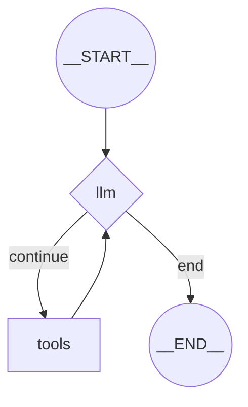

# Spring AI Alibaba Graph Core 模块详解

> Graph Core 是 Spring AI Alibaba 的核心引擎，提供了基于图（Graph）的流程编排和状态管理能力。本文档深入解析其设计理念、核心组件和实现细节。

---

## 一、模块定位与价值

### 1.1 为什么需要 Graph？

传统的命令式代码（if-else、for 循环）在处理 AI 应用的复杂流程时存在局限：
- **难以可视化**：代码逻辑散落在各处，难以全局把控
- **状态管理混乱**：跨步骤的上下文传递容易出错
- **不支持中断恢复**：用户主动中断后无法继续执行

Graph Core 通过**有向图**（Directed Graph）的方式解决这些问题：
```
                     ┌──────────┐
                     │  START   │
                     └────┬─────┘
                          │
                     ┌────▼─────┐
                     │ LLM 推理 │
                     └────┬─────┘
                          │
                    ┌─────▼──────┐
                    │ 是否需要   │
                    │ 调用工具？ │
                    └──┬─────┬───┘
                   是  │     │ 否
                  ┌────▼──┐  │
                  │ 工具  │  │
                  │ 执行  │  │
                  └──┬────┘  │
                     │       │
                     └───┬───┘
                         │
                    ┌────▼────┐
                    │   END   │
                    └─────────┘
```

### 1.2 核心价值
1. **流程可视化**：通过 `getGraph(Type.MERMAID)` 生成 Mermaid 图
2. **状态持久化**：内置 Checkpoint 机制，支持中断恢复
3. **异步高性能**：基于 Project Reactor 的响应式编程
4. **灵活扩展**：支持子图嵌套、并行执行、条件路由

---

## 二、核心概念与数据结构

### 2.1 StateGraph (状态图)

**定位**：业务流程的编排容器

#### 2.1.1 基本构成
```java
public class StateGraph {
    public static final String START = "__START__";    // 入口节点
    public static final String END = "__END__";        // 出口节点
    
    final Nodes nodes = new Nodes();                   // 节点集合
    final Edges edges = new Edges();                   // 边集合
    private KeyStrategyFactory keyStrategyFactory;     // 状态更新策略工厂
    private StateSerializer stateSerializer;           // 状态序列化器
}
```

#### 2.1.2 构建 API
```java
// 1. 创建状态图
StateGraph graph = new StateGraph("客服流程", () -> {
    Map<String, KeyStrategy> strategies = new HashMap<>();
    strategies.put("messages", new AppendStrategy());  // 消息列表追加
    strategies.put("userInfo", new ReplaceStrategy()); // 用户信息覆盖
    return strategies;
});

// 2. 添加节点
graph.addNode("llm", llmAction);              // 普通节点
graph.addNode("tools", toolsAction);          // 工具节点

// 3. 添加边
graph.addEdge(START, "llm");                  // 固定边
graph.addConditionalEdges("llm", router,      // 条件边
    Map.of(
        "continue", "tools",
        "end", END
    )
);
graph.addEdge("tools", "llm");

// 4. 编译
CompiledGraph compiled = graph.compile();
```

### 2.2 OverAllState (全局状态)

**定位**：图执行过程中的共享数据容器

#### 2.2.1 核心字段
```java
public final class OverAllState implements Serializable {
    private final Map<String, Object> data;              // 实际数据
    private final Map<String, KeyStrategy> keyStrategies; // 更新策略
    private Store store;                                 // 长期记忆存储
}
```

#### 2.2.2 状态更新策略 (KeyStrategy)
| 策略类型 | 行为 | 使用场景 |
|---------|------|----------|
| **ReplaceStrategy** | 覆盖旧值 | 单值字段（如用户ID） |
| **AppendStrategy** | 追加到列表 | 消息列表、日志 |
| **RemoveByHash** | 按哈希移除 | 清理特定消息 |
| **自定义 Reducer** | 自定义归约逻辑 | 复杂聚合场景 |

**示例：消息列表的追加**
```java
// 初始状态
state = { "messages": [UserMessage("你好")] }

// 节点更新
return { "messages": [AssistantMessage("您好，有什么可以帮您？")] }

// 合并后（AppendStrategy）
state = { 
    "messages": [
        UserMessage("你好"), 
        AssistantMessage("您好，有什么可以帮您？")
    ] 
}
```

### 2.3 Node (节点)

**定位**：图中的执行单元

#### 2.3.1 节点类型
```
Node (基类)
    ├── 普通节点：执行业务逻辑
    ├── ParallelNode：并行执行多个子节点
    ├── SubCompiledGraphNode：嵌套已编译的子图
    └── SubStateGraphNode：嵌套未编译的子图（编译时展开）
```

#### 2.3.2 节点 Action 接口
```java
@FunctionalInterface
public interface AsyncNodeAction {
    CompletableFuture<Map<String, Object>> apply(OverAllState state);
}
```

**节点职责**：
- 接收当前状态
- 执行业务逻辑
- 返回状态更新（增量）

### 2.4 Edge (边)

**定位**：定义节点间的流转逻辑

#### 2.4.1 边的类型
1. **固定边**（Direct Edge）
```java
graph.addEdge("nodeA", "nodeB");  // A 执行完后一定跳转到 B
```

2. **条件边**（Conditional Edge）
```java
graph.addConditionalEdges("decision", 
    (state, config) -> {
        List<Message> messages = state.value("messages").get();
        AssistantMessage last = (AssistantMessage) messages.get(messages.size() - 1);
        return last.hasToolCalls() ? "continue" : "end";
    },
    Map.of(
        "continue", "tools",
        "end", END
    )
);
```

3. **并行边**（Parallel Edge）
```java
graph.addEdge("fanout", "task1");
graph.addEdge("fanout", "task2");  // task1 和 task2 并行执行
graph.addEdge("fanout", "task3");
```

---

## 三、Checkpoint 系统（检查点机制）

### 3.1 设计目标
- **中断恢复**：用户关闭页面后可以从断点继续
- **版本回溯**：查看历史状态，支持 A/B 测试
- **审计日志**：记录 AI 决策的完整链路

### 3.2 Checkpoint 数据结构
```java
public class Checkpoint {
    private final String id;              // UUID，唯一标识
    private Map<String, Object> state;    // 完整状态快照
    private String nodeId;                // 当前执行到的节点
    private String nextNodeId;            // 下一个要执行的节点
}
```

### 3.3 持久化实现

#### 3.3.1 RedisSaver（推荐生产使用）
**存储结构**：
```
Key: graph:checkpoint:content:{threadId}
Value: [Checkpoint1, Checkpoint2, ...] (JSON序列化的列表)

Lock: graph:checkpoint:lock:{threadId}
```

**并发控制**：
```java
RLock lock = redisson.getLock(LOCK_PREFIX + threadId);
try {
    boolean acquired = lock.tryLock(2, TimeUnit.MILLISECONDS);
    if (acquired) {
        // 读写操作
        RBucket<String> bucket = redisson.getBucket(PREFIX + threadId);
        String json = bucket.get();
        List<Checkpoint> checkpoints = objectMapper.readValue(json, ...);
        // ... 业务逻辑
    }
} finally {
    if (acquired) {
        lock.unlock();
    }
}
```

**为什么用分布式锁？**
- 同一个用户可能在多个设备同时对话
- 防止并发写入导致状态覆盖
- 保证 Checkpoint 的线性一致性

#### 3.3.2 其他实现
| 实现类 | 存储介质 | 适用场景 |
|--------|---------|----------|
| **JdbcSaver** | PostgreSQL | 需要事务和复杂查询 |
| **MongoSaver** | MongoDB | 文档型数据，灵活 Schema |
| **FileSystemSaver** | 本地文件 | 测试、单机部署 |
| **MemorySaver** | 内存（HashMap） | 单元测试 |

---

## 四、执行引擎

### 4.1 CompiledGraph (编译后的图)

**作用**：将 StateGraph 转换为可执行的运行时结构

#### 4.1.1 编译过程
```java
StateGraph graph = new StateGraph(...);
graph.addNode(...);
graph.addEdge(...);

// 编译时做了什么？
CompiledGraph compiled = graph.compile(CompileConfig.builder()
    .checkpointSaver(redisSaver)          // 配置持久化
    .interruptsBefore(List.of("tools"))   // 工具执行前中断
    .recursionLimit(25)                   // 最大迭代次数
    .build()
);
```

编译步骤：
1. **验证图结构**：检查是否有孤立节点、缺失 START 边等
2. **展开子图**：将 SubStateGraphNode 展开为扁平结构
3. **创建节点工厂**：存储 `ActionFactory` 而非实例（线程安全）
4. **构建边映射**：建立 `sourceId -> EdgeValue` 的快速查找表

#### 4.1.2 为什么需要 ActionFactory？
```java
// ❌ 错误做法：共享同一个实例（非线程安全）
nodeInstances.put("llm", new LlmNode(model));

// ✅ 正确做法：存储工厂函数
nodeFactories.put("llm", (config) -> new LlmNode(model));
```
每次执行时创建新实例，避免状态污染。

### 4.2 GraphRunner (图执行器)

**作用**：驱动图的实际执行

#### 4.2.1 执行流程
```java
GraphRunner runner = new GraphRunner(compiledGraph, config);
Flux<NodeOutput> stream = runner.run(initialState);

// 流式处理
stream.subscribe(
    output -> System.out.println("节点输出: " + output),
    error -> System.err.println("执行失败: " + error),
    () -> System.out.println("执行完成")
);
```

#### 4.2.2 核心执行逻辑
```
1. 从 START 边获取入口节点
   ↓
2. 执行节点 Action
   ↓
3. 更新状态（合并节点输出）
   ↓
4. 保存 Checkpoint
   ↓
5. 检查中断条件
   ├─ 需要中断：返回中断标识
   └─ 继续执行：根据边跳转到下一个节点
   ↓
6. 到达 END 节点，返回最终状态
```

#### 4.2.3 中断机制
```java
// 配置中断点
CompileConfig config = CompileConfig.builder()
    .interruptsBefore(List.of("tools"))  // 工具执行前中断
    .interruptsAfter(List.of("llm"))     // LLM 推理后中断
    .build();

// 执行
Flux<NodeOutput> stream = compiled.stream(inputs, RunnableConfig.builder()
    .threadId("user-123")
    .build()
);

// 恢复执行
Flux<NodeOutput> resume = compiled.stream(inputs, RunnableConfig.builder()
    .threadId("user-123")
    .checkPointId("abc-123")  // 从特定检查点恢复
    .build()
);
```

**中断类型**：
- **interruptsBefore**：节点执行前中断（如人工审核）
- **interruptsAfter**：节点执行后中断（如等待用户反馈）

---

## 五、异步执行与流式输出

### 5.1 基于 Project Reactor 的异步模型

**为什么选择 Reactor？**
- 与 Spring AI 的 Flux 流式输出无缝集成
- 支持背压（Backpressure），防止内存溢出
- 声明式编程，代码简洁

#### 5.1.1 流式执行示例
```java
compiled.stream(inputs, config)
    .doOnNext(output -> {
        System.out.println("节点: " + output.node());
        System.out.println("状态: " + output.state());
    })
    .subscribe();
```

### 5.2 StreamingOutput (流式输出封装)

**应用场景**：LLM 打字机效果

```java
// LLM 节点返回流式内容
AsyncNodeAction llmAction = (state, config) -> {
    return chatModel.stream(prompt)
        .map(chunk -> Map.of(
            "messages", List.of(new AssistantMessage(chunk.getOutput()))
        ));
};
```

前端效果：
```
思考中... → "我" → "我需要" → "我需要查询" → "我需要查询天气"
```

---

## 六、高级特性

### 6.1 子图嵌套

**场景**：将复杂流程拆分为多个独立子图

```java
// 子图：工具执行流程
StateGraph toolGraph = new StateGraph(...);
toolGraph.addNode("validate", validateAction);
toolGraph.addNode("execute", executeAction);
toolGraph.addNode("format", formatAction);
toolGraph.addEdge(START, "validate");
toolGraph.addEdge("validate", "execute");
toolGraph.addEdge("execute", "format");
toolGraph.addEdge("format", END);

// 主图：嵌套子图
StateGraph mainGraph = new StateGraph(...);
mainGraph.addNode("llm", llmAction);
mainGraph.addNode("tools", toolGraph.compile());  // 嵌套已编译子图
mainGraph.addEdge(START, "llm");
mainGraph.addConditionalEdges("llm", router, 
    Map.of("tool_call", "tools", "end", END)
);
mainGraph.addEdge("tools", "llm");
```

**子图隔离**：
- 子图的节点 ID 会自动加前缀（如 `tools:validate`）
- 子图的 START/END 会映射到父图的节点

### 6.2 并行执行

**场景**：同时调用多个独立的工具或 API

```java
// 定义并行节点
graph.addNode("search_weather", weatherAction);
graph.addNode("search_news", newsAction);
graph.addNode("search_stock", stockAction);

// 从同一个节点连出多条边
graph.addEdge("fanout", "search_weather");
graph.addEdge("fanout", "search_news");
graph.addEdge("fanout", "search_stock");

// 汇聚到下一个节点
graph.addEdge("fanout", "aggregate");
```

**执行效果**：
```
fanout → [weather, news, stock] 并行执行 → aggregate 汇总结果
```

### 6.3 Store (长期记忆)

**场景**：跨会话的持久化存储

```java
// 配置 Store
Store store = new MongoStore(mongoClient);
CompileConfig config = CompileConfig.builder()
    .store(store)
    .build();

// 在节点中使用
AsyncNodeAction action = (state, config) -> {
    // 存储
    state.getStore().put("user_preference", "namespace", 
        StoreItem.builder()
            .key("theme")
            .value("dark")
            .build()
    );
    
    // 读取
    List<StoreItem> items = state.getStore().search(
        StoreSearchRequest.builder()
            .namespace("user_preference")
            .build()
    );
    
    return CompletableFuture.completedFuture(Map.of());
};
```

**与 Checkpoint 的区别**：
- **Checkpoint**：短期状态，随会话结束而清理
- **Store**：长期记忆，永久保存（如用户偏好）

---

## 七、可视化与调试

### 7.1 Mermaid 图生成
```java
GraphRepresentation repr = compiled.getGraph(
    GraphRepresentation.Type.MERMAID
);
System.out.println(repr.getContent());
```

输出：


### 7.2 状态历史查询
```java
// 获取某个会话的所有 Checkpoint
Collection<StateSnapshot> history = compiled.getStateHistory(
    RunnableConfig.builder()
        .threadId("user-123")
        .build()
);

// 查看每个状态快照
history.forEach(snapshot -> {
    System.out.println("节点: " + snapshot.getNode());
    System.out.println("状态: " + snapshot.getState());
    System.out.println("时间: " + snapshot.getCheckpoint().getId());
});
```

---

## 八、最佳实践

### 8.1 状态设计原则
1. **最小化状态**：只存储必要的数据，避免冗余
2. **类型安全**：使用 TypeReference 读取状态
```java
List<Message> messages = state.value("messages", new TypeRef<List<Message>>(){});
```
3. **不可变性**：状态更新返回新对象，不修改原对象

### 8.2 性能优化
1. **使用 Redis 作为 Checkpoint 存储**：比 JDBC 快 10 倍
2. **合理设置 recursionLimit**：防止无限循环
3. **避免大对象序列化**：图片等二进制数据应存储在 Store 中

### 8.3 异常处理
```java
compiled.stream(inputs, config)
    .onErrorResume(error -> {
        if (error instanceof ToolExecutionException) {
            // 工具执行失败，返回默认值
            return Flux.just(NodeOutput.of(state));
        }
        return Flux.error(error);
    })
    .subscribe();
```

---

## 九、总结

Graph Core 通过以下机制实现了企业级 AI 应用的流程编排：

| 能力 | 实现方式 | 价值 |
|------|---------|------|
| **流程可视化** | StateGraph + Mermaid | 降低理解成本 |
| **状态持久化** | Checkpoint + RedisSaver | 支持中断恢复 |
| **异步高性能** | Project Reactor | 提高吞吐量 |
| **灵活扩展** | 子图嵌套 + 并行执行 | 应对复杂场景 |
| **长期记忆** | Store 接口 | 跨会话存储 |

它是整个 Spring AI Alibaba 框架的基石，为上层的 Agent Framework 提供了坚实的底层支撑。

