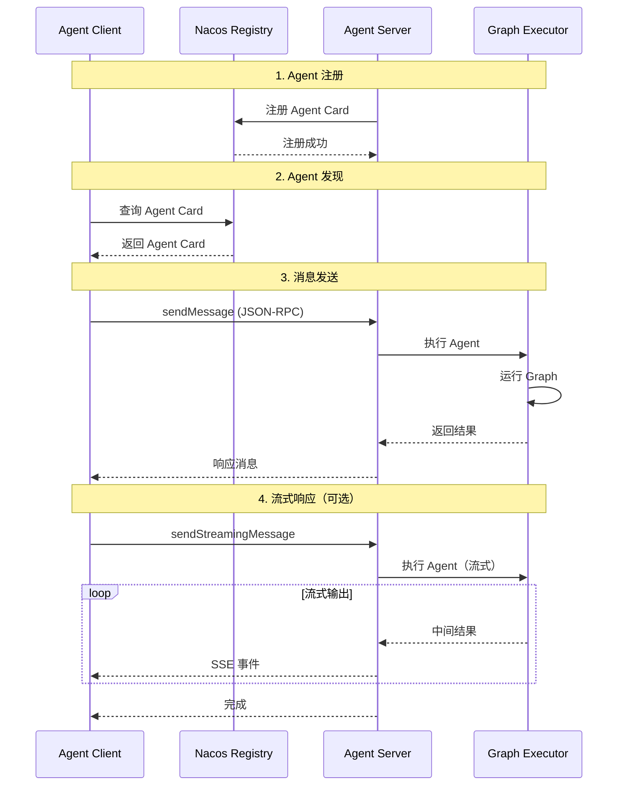

# Spring AI Alibaba A2A 模块专项分析

> **版本**: 1.0  
> **作者**: Spring AI Alibaba Team  
> **最后更新**: 2025-10-02

---

## 📑 目录

1. [模块概述](#1-模块概述)
2. [A2A 协议详解](#2-a2a-协议详解)
3. [架构设计](#3-架构设计)
4. [核心子模块](#4-核心子模块)
5. [Agent Card 机制](#5-agent-card-机制)
6. [A2A 服务端实现](#6-a2a-服务端实现)
7. [A2A 客户端实现](#7-a2a-客户端实现)
8. [Agent Registry 注册发现](#8-agent-registry-注册发现)
9. [JSON-RPC 通信](#9-json-rpc-通信)
10. [Agent-to-Agent 交互模式](#10-agent-to-agent-交互模式)
11. [最佳实践](#11-最佳实践)
12. [配置指南](#12-配置指南)

---

## 1. 模块概述

### 1.1 什么是 A2A

**A2A (Agent-to-Agent)** 是一个开放协议，用于实现智能体之间的标准化通信和协作。

**Spring AI Alibaba A2A** 提供完整的 A2A 协议实现，包括：
- 🤖 **Agent Card**: 智能体能力自描述机制
- 🔄 **JSON-RPC 2.0**: 基于 JSON-RPC 的通信协议
- 📡 **消息传递**: 同步/异步消息交换
- 🌐 **服务注册发现**: 基于 Nacos 的 Agent 注册中心
- 🔌 **多传输协议**: HTTP、SSE、WebSocket 等
- 🎯 **Graph Agent 集成**: 与 Graph-Core 无缝集成

### 1.2 模块结构

```
spring-ai-alibaba-a2a/
├── spring-ai-alibaba-a2a-common/          # 公共组件
│   ├── constants/
│   │   └── A2aConstants                   # 协议常量
│   ├── registry/
│   │   ├── AgentRegistry                  # 注册接口
│   │   └── AgentRegistryService           # 注册服务
│   ├── route/
│   │   ├── A2aRouterProvider              # 路由提供者
│   │   └── JsonRpcA2aRouterProvider       # JSON-RPC 路由实现
│   ├── server/
│   │   ├── A2aRequestHandler              # 请求处理器
│   │   ├── JsonRpcA2aRequestHandler       # JSON-RPC 处理器
│   │   ├── GraphAgentExecutor             # Graph Agent 执行器
│   │   └── A2aServerExecutorProvider      # 执行器提供者
│   └── utils/
│       └── InetUtils                      # 网络工具
│
└── spring-ai-alibaba-a2a-registry/        # 注册发现
    └── nacos/
        ├── discovery/
        │   ├── NacosAgentCardProvider     # Agent Card 提供者
        │   └── NacosAgentCardWrapper      # Agent Card 包装器
        ├── register/
        │   ├── NacosAgentRegistry         # Nacos 注册实现
        │   └── NacosA2aRegistryProperties # 注册配置
        ├── service/
        │   └── NacosA2aOperationService   # Nacos 操作服务
        └── utils/
            └── AgentCardConverterUtil     # Agent Card 转换工具
```

### 1.3 依赖关系

```xml
<dependencies>
    <!-- A2A SDK -->
    <dependency>
        <groupId>io.github.a2asdk</groupId>
        <artifactId>a2a-java-sdk-server</artifactId>
    </dependency>
    
    <dependency>
        <groupId>io.github.a2asdk</groupId>
        <artifactId>a2a-java-sdk-client</artifactId>
    </dependency>
    
    <!-- Graph Core（用于 Graph Agent）-->
    <dependency>
        <groupId>com.alibaba.cloud.ai</groupId>
        <artifactId>spring-ai-alibaba-graph-core</artifactId>
    </dependency>
    
    <!-- Nacos 服务发现 -->
    <dependency>
        <groupId>com.alibaba.nacos</groupId>
        <artifactId>nacos-client</artifactId>
    </dependency>
    
    <!-- Spring WebFlux（用于 SSE）-->
    <dependency>
        <groupId>org.springframework</groupId>
        <artifactId>spring-webflux</artifactId>
    </dependency>
</dependencies>
```

---

## 2. A2A 协议详解

### 2.1 A2A 核心概念

**A2A 协议定义了智能体之间的通信规范：**

1. **Agent Card（智能体名片）**: 描述 Agent 的能力、接口和协议
2. **Message（消息）**: Agent 之间交换的信息单元
3. **Task（任务）**: Agent 执行的工作单元
4. **Protocol（协议）**: 通信协议（JSON-RPC 2.0）
5. **Transport（传输）**: 底层传输协议（HTTP、SSE、WebSocket）

### 2.2 Agent Card 规范

**Agent Card 完整结构**：

```json
{
  "name": "weather-assistant",
  "version": "1.0.0",
  "a2aProtocolVersion": "0.2.5",
  "description": "A weather forecast assistant",
  "preferredTransport": "JSONRPC",
  "metadata": {
    "author": "Spring AI Alibaba Team",
    "tags": ["weather", "forecast"],
    "capabilities": ["text", "structured-output"]
  },
  "endpoints": [
    {
      "path": "/a2a",
      "methods": ["POST"],
      "transport": "JSONRPC"
    }
  ]
}
```

**字段说明**：

| 字段 | 类型 | 说明 |
|------|------|------|
| `name` | String | Agent 唯一名称 |
| `version` | String | Agent 版本号 |
| `a2aProtocolVersion` | String | A2A 协议版本 |
| `description` | String | Agent 描述 |
| `preferredTransport` | String | 首选传输协议 |
| `metadata` | Object | 元数据（作者、标签、能力等）|
| `endpoints` | Array | 通信端点列表 |

### 2.3 JSON-RPC 2.0 规范

**A2A 使用 JSON-RPC 2.0 进行通信**：

**请求格式**：

```json
{
  "jsonrpc": "2.0",
  "id": "req-123",
  "method": "agent.sendMessage",
  "params": {
    "message": {
      "role": "user",
      "parts": [
        {
          "kind": "text",
          "text": "What's the weather in Beijing?"
        }
      ]
    },
    "metadata": {
      "streaming": true
    }
  }
}
```

**响应格式**：

```json
{
  "jsonrpc": "2.0",
  "id": "req-123",
  "result": {
    "message": {
      "role": "assistant",
      "parts": [
        {
          "kind": "text",
          "text": "The weather in Beijing is sunny, 25°C."
        }
      ]
    }
  }
}
```

**错误响应**：

```json
{
  "jsonrpc": "2.0",
  "id": "req-123",
  "error": {
    "code": -32603,
    "message": "Internal error",
    "data": {
      "details": "Agent execution failed"
    }
  }
}
```

### 2.4 支持的传输协议

| 传输类型 | 说明 | 适用场景 |
|---------|------|---------|
| **JSONRPC** | JSON-RPC over HTTP | 同步请求/响应 |
| **HTTP+JSON** | RESTful API | 简单集成 |
| **GRPC** | gRPC 协议 | 高性能场景 |

---

## 3. 架构设计

### 3.1 整体架构

```
┌─────────────────────────────────────────────────────────────┐
│                     AI Application Layer                     │
│        (Multi-Agent System, Agent Orchestration)             │
└─────────────────────────────────────────────────────────────┘
                            ↓
┌─────────────────────────────────────────────────────────────┐
│                      A2A Client Layer                        │
│    (Agent Invocation, Message Sending, Response Handling)   │
└─────────────────────────────────────────────────────────────┘
                            ↓
┌─────────────────────────────────────────────────────────────┐
│                   A2A Registry (Nacos)                       │
│    (Agent Card 注册、发现、订阅、更新)                      │
└─────────────────────────────────────────────────────────────┘
                            ↓
┌─────────────────────────────────────────────────────────────┐
│                      A2A Server Layer                        │
│    (Request Routing, Protocol Handling, Agent Execution)    │
└─────────────────────────────────────────────────────────────┘
                            ↓
┌─────────────────────────────────────────────────────────────┐
│                    Agent Executor Layer                      │
│    (Graph Agent Executor, Custom Executor)                  │
└─────────────────────────────────────────────────────────────┘
```

### 3.2 核心交互流程



---

## 4. 核心子模块

### 4.1 spring-ai-alibaba-a2a-common

**公共组件模块，提供基础功能。**

**核心常量**：

```java
public class A2aConstants {
    // A2A 协议版本
    public static final String DEFAULT_A2A_PROTOCOL_VERSION = "0.2.5";
    
    // Agent 默认版本
    public static final String DEFAULT_AGENT_VERSION = "1.0.0";
    
    // 传输类型
    public static final String AGENT_TRANSPORT_TYPE_JSON_RPC = "JSONRPC";
    public static final String AGENT_TRANSPORT_TYPE_GRPC = "GRPC";
    public static final String AGENT_TRANSPORT_TYPE_REST = "HTTP+JSON";
}
```

**核心接口**：

```java
// 1. Agent 注册接口
public interface AgentRegistry {
    String registryName();
    void register(AgentCard agentCard);
}

// 2. Agent 注册服务
public interface AgentRegistryService {
    void registerAgent(AgentCard agentCard, AgentRegistry registry);
    List<AgentCard> discoverAgents(String pattern);
}

// 3. A2A 路由提供者
public interface A2aRouterProvider<T extends A2aRequestHandler> {
    RouterFunction<ServerResponse> getRouter(T handler);
}

// 4. A2A 请求处理器
public interface A2aRequestHandler {
    AgentCard getAgentCard();
    Object onHandler(String body, ServerRequest.Headers headers);
}
```

### 4.2 spring-ai-alibaba-a2a-registry

**服务注册与发现模块（基于 Nacos）。**

**核心功能**：
- ✅ Agent Card 注册
- ✅ Agent Card 发现
- ✅ Agent Card 订阅（实时更新）
- ✅ 服务端点注册

---

## 5. Agent Card 机制

### 5.1 Agent Card 结构

**Agent Card (A2A SDK 定义)**：

```java
public class AgentCard {
    private String name;                    // Agent 名称
    private String version;                 // Agent 版本
    private String a2aProtocolVersion;      // A2A 协议版本
    private String description;             // Agent 描述
    private String preferredTransport;      // 首选传输协议
    private Map<String, Object> metadata;   // 元数据
    private List<Endpoint> endpoints;       // 端点列表
}

public class Endpoint {
    private String path;                    // 端点路径
    private List<String> methods;           // 支持的 HTTP 方法
    private String transport;               // 传输协议
}
```

### 5.2 Agent Card 配置

**A2aServerAgentCardProperties**：

```java
@ConfigurationProperties(prefix = "spring.ai.alibaba.a2a.server.agent-card")
public class A2aServerAgentCardProperties {
    
    // Agent 名称
    private String name;
    
    // Agent 版本
    private String version = A2aConstants.DEFAULT_AGENT_VERSION;
    
    // A2A 协议版本
    private String a2aProtocolVersion = A2aConstants.DEFAULT_A2A_PROTOCOL_VERSION;
    
    // Agent 描述
    private String description;
    
    // 首选传输协议
    private String preferredTransport = A2aConstants.AGENT_TRANSPORT_TYPE_JSON_RPC;
    
    // 自定义元数据
    private Map<String, Object> metadata = new HashMap<>();
}
```

**使用示例**：

```yaml
spring:
  ai:
    alibaba:
      a2a:
        server:
          agent-card:
            name: weather-assistant
            version: 1.0.0
            description: A weather forecast assistant
            preferred-transport: JSONRPC
            metadata:
              author: Spring AI Alibaba Team
              tags:
                - weather
                - forecast
              capabilities:
                - text
                - structured-output
```

### 5.3 Agent Card 提供者

**NacosAgentCardProvider**：

```java
public class NacosAgentCardProvider implements AgentCardProvider {
    
    private final A2aService a2aService;
    private AgentCardWrapper agentCard;
    
    @Override
    public AgentCardWrapper getAgentCard(String agentName) {
        try {
            // 1. 从 Nacos 获取 Agent Card
            com.alibaba.cloud.ai.a2a.nacos.AgentCard nacosAgentCard = 
                a2aService.getAgentCard(agentName);
            
            // 2. 转换为 A2A SDK AgentCard
            io.a2a.spec.AgentCard a2aAgentCard = 
                AgentCardConverterUtil.convertToA2aAgentCard(nacosAgentCard);
            
            // 3. 包装
            agentCard = new NacosAgentCardWrapper(a2aAgentCard);
            
            // 4. 订阅更新
            a2aService.subscribeAgentCard(agentName, new AbstractNacosAgentCardListener() {
                @Override
                public void onEvent(NacosAgentCardEvent event) {
                    // 更新本地 Agent Card
                    agentCard.setAgentCard(
                        AgentCardConverterUtil.convertToA2aAgentCard(event.getAgentCard())
                    );
                }
            });
            
            return agentCard;
            
        } catch (NacosException e) {
            throw new NacosRuntimeException(e.getErrCode(), e.getErrMsg());
        }
    }
}
```

**NacosAgentCardWrapper**：

```java
public class NacosAgentCardWrapper implements AgentCardWrapper {
    
    private volatile io.a2a.spec.AgentCard agentCard;
    
    @Override
    public io.a2a.spec.AgentCard getAgentCard() {
        return agentCard;
    }
    
    public void setAgentCard(io.a2a.spec.AgentCard agentCard) {
        this.agentCard = agentCard;
    }
}
```

---

## 6. A2A 服务端实现

### 6.1 服务端架构

```
HTTP Request → JsonRpcA2aRouterProvider → JsonRpcA2aRequestHandler 
                                              ↓
                                        GraphAgentExecutor
                                              ↓
                                        CompiledGraph
                                              ↓
                                        Response (JSON-RPC / SSE)
```

### 6.2 JsonRpcA2aRouterProvider

**路由配置**：

```java
public class JsonRpcA2aRouterProvider implements A2aRouterProvider<JsonRpcA2aRequestHandler> {
    
    public static final String DEFAULT_WELL_KNOWN_URL = "/.well-known/agent.json";
    public static final String DEFAULT_MESSAGE_URL = "/a2a";
    
    private final String wellKnownUrl;
    private final String messageUrl;
    
    @Override
    public RouterFunction<ServerResponse> getRouter(JsonRpcA2aRequestHandler handler) {
        return RouterFunctions.route()
            // Agent Card 端点
            .GET(wellKnownUrl, new AgentCardHandler(handler))
            
            // 消息处理端点
            .POST(messageUrl, new MessageHandler(handler))
            
            .build();
    }
    
    // Agent Card 处理器
    private class AgentCardHandler implements HandlerFunction<ServerResponse> {
        @Override
        public ServerResponse handle(ServerRequest request) throws Exception {
            try {
                return ServerResponse.ok().body(handler.getAgentCard());
            } catch (Exception e) {
                return ServerResponse.status(HttpStatus.INTERNAL_SERVER_ERROR).build();
            }
        }
    }
    
    // 消息处理器
    private class MessageHandler implements HandlerFunction<ServerResponse> {
        @Override
        public ServerResponse handle(ServerRequest request) throws Exception {
            try {
                String bodyString = request.body(String.class);
                Object result = handler.onHandler(bodyString, request.headers());
                
                // 判断响应类型
                if (result instanceof Flux<?>) {
                    return buildSseResponse((Flux<?>) result);
                } else {
                    return buildJsonRpcResponse(result);
                }
            } catch (Exception e) {
                return ServerResponse.status(HttpStatus.INTERNAL_SERVER_ERROR).build();
            }
        }
        
        // 构建 JSON-RPC 响应
        private ServerResponse buildJsonRpcResponse(Object result) {
            return ServerResponse.ok().body(result);
        }
        
        // 构建 SSE 响应
        private ServerResponse buildSseResponse(Flux<?> result) {
            return ServerResponse.sse(sseBuilder -> {
                result.subscribe(event -> {
                    if (event instanceof JSONRPCResponse) {
                        try {
                            String sseBody = Utils.OBJECT_MAPPER.writeValueAsString(event);
                            sseBuilder.data(sseBody);
                            
                            // 检查是否完成
                            if (isTaskComplete((JSONRPCResponse<?>) event)) {
                                sseBuilder.complete();
                            }
                        } catch (IOException e) {
                            sseBuilder.error(e);
                        }
                    }
                });
            }, Duration.ZERO);
        }
    }
}
```

### 6.3 JsonRpcA2aRequestHandler

**请求处理器**：

```java
public class JsonRpcA2aRequestHandler implements A2aRequestHandler {
    
    private final JSONRPCHandler jsonRpcHandler;
    
    @Override
    public AgentCard getAgentCard() {
        return jsonRpcHandler.getAgentCard();
    }
    
    @Override
    public Object onHandler(String body, ServerRequest.Headers headers) {
        // 1. 判断是否流式请求
        boolean streaming = isStreamingRequest(body);
        
        // 2. 处理请求
        try {
            if (streaming) {
                return handleStreamRequest(body);
            } else {
                return handleNonStreamRequest(body);
            }
        } catch (JsonProcessingException e) {
            return new JSONRPCErrorResponse(null, new JSONParseError());
        }
    }
    
    private boolean isStreamingRequest(String requestBody) {
        try {
            JsonNode node = Utils.OBJECT_MAPPER.readTree(requestBody);
            JsonNode method = node != null ? node.get("method") : null;
            return method != null && 
                   (SendStreamingMessageRequest.METHOD.equals(method.asText()) ||
                    TaskResubscriptionRequest.METHOD.equals(method.asText()));
        } catch (Exception e) {
            return false;
        }
    }
    
    private Flux<?> handleStreamRequest(String body) throws JsonProcessingException {
        // 解析流式请求
        JSONRPCRequest request = Utils.OBJECT_MAPPER.readValue(body, JSONRPCRequest.class);
        
        // 委托给 JSON-RPC 处理器（返回 Flux）
        return jsonRpcHandler.handleStreamingRequest(request);
    }
    
    private Object handleNonStreamRequest(String body) throws JsonProcessingException {
        // 解析请求
        JSONRPCRequest request = Utils.OBJECT_MAPPER.readValue(body, JSONRPCRequest.class);
        
        // 委托给 JSON-RPC 处理器（返回单个响应）
        return jsonRpcHandler.handleRequest(request);
    }
}
```

### 6.4 GraphAgentExecutor

**Graph Agent 执行器**：

```java
public class GraphAgentExecutor implements AgentExecutor {
    
    private final Agent agent;
    
    public GraphAgentExecutor(Agent agent) {
        this.agent = agent;
    }
    
    @Override
    public void execute(RequestContext context, EventQueue eventQueue) throws JSONRPCError {
        try {
            // 1. 提取消息
            Message message = context.getParams().message();
            String input = extractTextFromMessage(message);
            
            // 2. 构建输入
            Map<String, Object> inputs = Map.of();
            if (StringUtils.hasLength(input)) {
                inputs = Map.of("messages", List.of(new UserMessage(input)));
            }
            
            // 3. 判断是否流式执行
            if (isStreamRequest(context)) {
                executeStreamTask(inputs, context, eventQueue);
            } else {
                executeForNonStreamTask(inputs, context, eventQueue);
            }
            
        } catch (Exception e) {
            log.error("Agent execution failed", e);
            eventQueue.enqueueEvent(A2A.toAgentMessage("Agent execution failed: " + e.getMessage()));
        }
    }
    
    private void executeStreamTask(Map<String, Object> inputs, RequestContext context, EventQueue eventQueue) {
        // 获取 RunnableConfig
        RunnableConfig config = getRunnableConfig(context);
        
        // 流式执行 Agent
        CompiledGraph graph = agent.getAndCompileGraph();
        Flux<NodeOutput> stream = graph.fluxStream(inputs, config);
        
        // 发送流式事件
        stream.subscribe(
            nodeOutput -> {
                // 发送中间结果
                eventQueue.enqueueEvent(A2A.toAgentMessage(nodeOutput.state().value("answer").orElse("")));
            },
            error -> {
                // 发送错误
                eventQueue.enqueueEvent(A2A.toAgentMessage("Error: " + error.getMessage()));
            },
            () -> {
                // 发送完成
                eventQueue.enqueueEvent(A2A.taskComplete());
            }
        );
    }
    
    private void executeForNonStreamTask(Map<String, Object> inputs, RequestContext context, EventQueue eventQueue) {
        // 获取 RunnableConfig
        RunnableConfig config = getRunnableConfig(context);
        
        // 同步执行 Agent
        CompiledGraph graph = agent.getAndCompileGraph();
        Optional<OverAllState> result = graph.call(inputs, config);
        
        // 发送结果
        if (result.isPresent()) {
            String answer = (String) result.get().value("answer").orElse("No answer");
            eventQueue.enqueueEvent(A2A.toAgentMessage(answer));
            eventQueue.enqueueEvent(A2A.taskComplete());
        } else {
            eventQueue.enqueueEvent(A2A.toAgentMessage("No result"));
        }
    }
    
    private RunnableConfig getRunnableConfig(RequestContext context) {
        // 从元数据提取 threadId
        Map<String, Object> metadata = context.getParams().metadata();
        String threadId = metadata != null ? (String) metadata.get("threadId") : null;
        
        return RunnableConfig.builder()
            .threadId(threadId != null ? threadId : "default-thread")
            .build();
    }
}
```

---

## 7. A2A 客户端实现

### 7.1 客户端调用流程

```java
// 1. 获取 Agent Card
AgentCardProvider cardProvider = new NacosAgentCardProvider(a2aService);
AgentCardWrapper wrapper = cardProvider.getAgentCard("weather-assistant");
io.a2a.spec.AgentCard agentCard = wrapper.getAgentCard();

// 2. 创建客户端
A2AClient client = A2AClientBuilder.create()
    .agentCard(agentCard)
    .build();

// 3. 发送消息（同步）
SendMessageRequest request = SendMessageRequest.builder()
    .message(Message.builder()
        .role("user")
        .parts(List.of(TextPart.of("What's the weather in Beijing?")))
        .build())
    .build();

SendMessageResponse response = client.sendMessage(request).get();
System.out.println(response.getMessage().getText());

// 4. 发送消息（流式）
SendStreamingMessageRequest streamRequest = SendStreamingMessageRequest.builder()
    .message(Message.builder()
        .role("user")
        .parts(List.of(TextPart.of("Tell me a story")))
        .build())
    .build();

client.sendStreamingMessage(streamRequest).subscribe(event -> {
    if (event instanceof TaskStatusUpdateEvent) {
        TaskStatusUpdateEvent statusEvent = (TaskStatusUpdateEvent) event;
        if (statusEvent.getMessage() != null) {
            System.out.print(statusEvent.getMessage().getText());
        }
    }
});
```

### 7.2 A2aClientAgentCardProperties

**客户端 Agent Card 配置**：

```java
@ConfigurationProperties(prefix = "spring.ai.alibaba.a2a.client.agent-card")
public class A2aClientAgentCardProperties {
    
    // 远程 Agent 名称
    private String remoteAgentName;
    
    // 远程 Agent 版本
    private String remoteAgentVersion;
    
    // 是否自动发现
    private boolean autoDiscover = true;
    
    // 手动指定端点（不使用自动发现时）
    private String endpoint;
    
    // 传输协议
    private String transport = A2aConstants.AGENT_TRANSPORT_TYPE_JSON_RPC;
}
```

**使用示例**：

```yaml
spring:
  ai:
    alibaba:
      a2a:
        client:
          agent-card:
            remote-agent-name: weather-assistant
            remote-agent-version: 1.0.0
            auto-discover: true
```

### 7.3 负载均衡客户端（未来扩展）

```java
// 多实例负载均衡
public class LoadBalancedA2AClient implements A2AClient {
    
    private final NamingService namingService;
    private final String agentName;
    private final LoadBalancer loadBalancer;
    
    @Override
    public CompletableFuture<SendMessageResponse> sendMessage(SendMessageRequest request) {
        // 1. 获取可用实例
        List<Instance> instances = namingService.selectInstances(agentName, true);
        
        // 2. 负载均衡选择
        Instance instance = loadBalancer.choose(instances);
        
        // 3. 构建客户端并调用
        String endpoint = buildEndpoint(instance);
        A2AClient client = A2AClientBuilder.create()
            .endpoint(endpoint)
            .build();
        
        return client.sendMessage(request)
            .exceptionally(error -> {
                // 4. 失败重试
                return retryWithAnotherInstance(request, instances, instance);
            });
    }
}
```

---

## 8. Agent Registry 注册发现

### 8.1 NacosAgentRegistry

**Nacos 注册实现**：

```java
public class NacosAgentRegistry implements AgentRegistry {
    
    private final NacosA2aOperationService a2aOperationService;
    private final NacosA2aProperties nacosA2aProperties;
    
    @Override
    public String registryName() {
        return String.format("Nacos[%s]", nacosA2aProperties.getServerAddr());
    }
    
    @Override
    public void register(AgentCard agentCard) {
        a2aOperationService.registerAgent(agentCard);
    }
}
```

### 8.2 NacosA2aOperationService

**Nacos 操作服务**：

```java
public class NacosA2aOperationService {
    
    private final A2aService a2aService;
    private final NacosA2aProperties nacosA2aProperties;
    private final A2aServerProperties a2aServerProperties;
    private final NacosA2aRegistryProperties registryProperties;
    
    /**
     * 注册 Agent
     */
    public void registerAgent(io.a2a.spec.AgentCard agentCard) {
        // 1. 转换为 Nacos Agent Card
        com.alibaba.cloud.ai.a2a.nacos.AgentCard nacosAgentCard = 
            AgentCardConverterUtil.convertToNacosAgentCard(agentCard);
        
        try {
            // 2. 发布 Agent Card
            tryReleaseAgentCard(nacosAgentCard);
            
            // 3. 注册服务端点
            registerEndpoint(nacosAgentCard);
            
        } catch (NacosException e) {
            log.error("Failed to register Agent Card: {}", agentCard.name(), e);
            throw new NacosRuntimeException(e.getErrCode(), e.getErrMsg());
        }
    }
    
    private void tryReleaseAgentCard(com.alibaba.cloud.ai.a2a.nacos.AgentCard agentCard) 
            throws NacosException {
        log.info("Registering Agent Card {} to Nacos namespace {}", 
                 agentCard.getName(), nacosA2aProperties.getNamespace());
        
        // 发布到 Nacos
        a2aService.releaseAgentCard(
            agentCard, 
            AiConstants.A2a.A2A_ENDPOINT_TYPE_SERVICE,
            registryProperties.isRegisterAsLatest()
        );
        
        log.info("Agent Card {} registered successfully", agentCard.getName());
    }
    
    private void registerEndpoint(com.alibaba.cloud.ai.a2a.nacos.AgentCard agentCard) 
            throws NacosException {
        // 构建端点信息
        AgentEndpoint endpoint = new AgentEndpoint();
        endpoint.setVersion(agentCard.getVersion());
        endpoint.setPath(a2aServerProperties.getMessageUrl());
        endpoint.setTransport(agentCard.getPreferredTransport());
        endpoint.setAddress(a2aServerProperties.getAddress());
        endpoint.setPort(a2aServerProperties.getPort());
        
        // 注册端点
        a2aService.registerAgentEndpoint(agentCard.getName(), endpoint);
    }
}
```

### 8.3 Agent Card 转换工具

**AgentCardConverterUtil**：

```java
public class AgentCardConverterUtil {
    
    /**
     * 转换为 Nacos Agent Card
     */
    public static com.alibaba.cloud.ai.a2a.nacos.AgentCard convertToNacosAgentCard(
        io.a2a.spec.AgentCard a2aCard
    ) {
        com.alibaba.cloud.ai.a2a.nacos.AgentCard nacosCard = 
            new com.alibaba.cloud.ai.a2a.nacos.AgentCard();
        
        nacosCard.setName(a2aCard.name());
        nacosCard.setVersion(a2aCard.version());
        nacosCard.setA2aProtocolVersion(a2aCard.a2aProtocolVersion());
        nacosCard.setDescription(a2aCard.description());
        nacosCard.setPreferredTransport(a2aCard.preferredTransport());
        nacosCard.setMetadata(a2aCard.metadata());
        
        // 转换端点
        if (a2aCard.endpoints() != null) {
            List<com.alibaba.cloud.ai.a2a.nacos.Endpoint> nacosEndpoints = 
                a2aCard.endpoints().stream()
                    .map(AgentCardConverterUtil::convertEndpoint)
                    .toList();
            nacosCard.setEndpoints(nacosEndpoints);
        }
        
        return nacosCard;
    }
    
    /**
     * 转换为 A2A SDK Agent Card
     */
    public static io.a2a.spec.AgentCard convertToA2aAgentCard(
        com.alibaba.cloud.ai.a2a.nacos.AgentCard nacosCard
    ) {
        return io.a2a.spec.AgentCard.builder()
            .name(nacosCard.getName())
            .version(nacosCard.getVersion())
            .a2aProtocolVersion(nacosCard.getA2aProtocolVersion())
            .description(nacosCard.getDescription())
            .preferredTransport(nacosCard.getPreferredTransport())
            .metadata(nacosCard.getMetadata())
            .endpoints(convertEndpoints(nacosCard.getEndpoints()))
            .build();
    }
    
    private static com.alibaba.cloud.ai.a2a.nacos.Endpoint convertEndpoint(
        io.a2a.spec.Endpoint a2aEndpoint
    ) {
        com.alibaba.cloud.ai.a2a.nacos.Endpoint nacosEndpoint = 
            new com.alibaba.cloud.ai.a2a.nacos.Endpoint();
        nacosEndpoint.setPath(a2aEndpoint.path());
        nacosEndpoint.setMethods(a2aEndpoint.methods());
        nacosEndpoint.setTransport(a2aEndpoint.transport());
        return nacosEndpoint;
    }
    
    private static List<io.a2a.spec.Endpoint> convertEndpoints(
        List<com.alibaba.cloud.ai.a2a.nacos.Endpoint> nacosEndpoints
    ) {
        if (nacosEndpoints == null) {
            return null;
        }
        
        return nacosEndpoints.stream()
            .map(ne -> io.a2a.spec.Endpoint.builder()
                .path(ne.getPath())
                .methods(ne.getMethods())
                .transport(ne.getTransport())
                .build())
            .toList();
    }
}
```

---

## 9. JSON-RPC 通信

### 9.1 JSON-RPC 方法

**A2A 定义的 JSON-RPC 方法**：

| 方法名 | 说明 | 请求类型 | 响应类型 |
|--------|------|---------|---------|
| `agent.sendMessage` | 发送消息（同步）| `SendMessageRequest` | `SendMessageResponse` |
| `agent.sendStreamingMessage` | 发送消息（流式）| `SendStreamingMessageRequest` | `TaskStatusUpdateEvent` (SSE) |
| `agent.taskResubscription` | 重新订阅任务 | `TaskResubscriptionRequest` | `TaskStatusUpdateEvent` (SSE) |

### 9.2 消息结构

**Message（消息）**：

```java
public class Message {
    private String role;                    // user / assistant / system
    private List<Part<?>> parts;            // 消息部分列表
}

// Part（消息部分）
public interface Part<T> {
    enum Kind {
        TEXT,           // 文本
        IMAGE,          // 图片
        AUDIO,          // 音频
        VIDEO,          // 视频
        FILE,           // 文件
        STRUCTURED      // 结构化数据
    }
    
    Kind getKind();
    T getContent();
}

// 文本部分
public class TextPart implements Part<String> {
    private String text;
    
    public static TextPart of(String text) {
        TextPart part = new TextPart();
        part.setText(text);
        return part;
    }
}

// 结构化部分
public class StructuredPart implements Part<Map<String, Object>> {
    private Map<String, Object> data;
}
```

### 9.3 任务状态

**TaskStatusUpdateEvent**：

```java
public class TaskStatusUpdateEvent {
    private String taskId;              // 任务 ID
    private TaskStatus status;          // 任务状态
    private Message message;            // 消息（可选）
    private Map<String, Object> data;   // 额外数据
    
    public enum TaskStatus {
        PENDING,        // 待处理
        RUNNING,        // 运行中
        COMPLETED,      // 已完成
        FAILED,         // 失败
        CANCELLED       // 已取消
    }
    
    public boolean isFinal() {
        return status == TaskStatus.COMPLETED || 
               status == TaskStatus.FAILED || 
               status == TaskStatus.CANCELLED;
    }
}
```

---

## 10. Agent-to-Agent 交互模式

### 10.1 单智能体调用

```java
// 场景：客户端调用单个 Agent
A2AClient client = A2AClientBuilder.create()
    .agentCard(weatherAgentCard)
    .build();

SendMessageRequest request = SendMessageRequest.builder()
    .message(Message.builder()
        .role("user")
        .parts(List.of(TextPart.of("What's the weather in Beijing?")))
        .build())
    .build();

SendMessageResponse response = client.sendMessage(request).get();
System.out.println(response.getMessage().getText());
```

### 10.2 智能体链式调用

```java
// 场景：Agent A 调用 Agent B，然后调用 Agent C

// Agent A 接收用户请求
public class AgentA {
    private A2AClient agentBClient;
    private A2AClient agentCClient;
    
    public String process(String userQuery) {
        // 1. 调用 Agent B（分类）
        SendMessageRequest classifyRequest = SendMessageRequest.builder()
            .message(Message.of("user", userQuery))
            .build();
        
        SendMessageResponse classifyResponse = agentBClient.sendMessage(classifyRequest).get();
        String category = classifyResponse.getMessage().getText();
        
        // 2. 根据分类调用 Agent C（处理）
        SendMessageRequest processRequest = SendMessageRequest.builder()
            .message(Message.of("user", "Process: " + category))
            .build();
        
        SendMessageResponse processResponse = agentCClient.sendMessage(processRequest).get();
        return processResponse.getMessage().getText();
    }
}
```

### 10.3 智能体协作（多 Agent 系统）

```java
// 场景：多个 Agent 协同完成任务

public class MultiAgentSystem {
    
    private A2AClient researchAgent;
    private A2AClient summaryAgent;
    private A2AClient reviewAgent;
    
    public String collaborativeResearch(String topic) {
        // 1. 研究 Agent 收集信息
        SendMessageResponse researchResult = researchAgent.sendMessage(
            SendMessageRequest.of(topic)
        ).get();
        
        // 2. 摘要 Agent 总结信息
        SendMessageResponse summaryResult = summaryAgent.sendMessage(
            SendMessageRequest.of("Summarize: " + researchResult.getMessage().getText())
        ).get();
        
        // 3. 审核 Agent 检查质量
        SendMessageResponse reviewResult = reviewAgent.sendMessage(
            SendMessageRequest.of("Review: " + summaryResult.getMessage().getText())
        ).get();
        
        return reviewResult.getMessage().getText();
    }
}
```

### 10.4 智能体委托

```java
// 场景：主 Agent 将子任务委托给专门的 Agent

public class MasterAgent {
    
    private Map<String, A2AClient> specializedAgents;
    
    public String delegate(String task) {
        // 1. 分析任务类型
        String taskType = analyzeTaskType(task);
        
        // 2. 选择合适的专门 Agent
        A2AClient specializedAgent = specializedAgents.get(taskType);
        
        if (specializedAgent == null) {
            return "No suitable agent for task: " + taskType;
        }
        
        // 3. 委托任务
        SendMessageResponse response = specializedAgent.sendMessage(
            SendMessageRequest.of(task)
        ).get();
        
        return response.getMessage().getText();
    }
}
```

### 10.5 智能体对话

```java
// 场景：两个 Agent 之间对话

public class AgentConversation {
    
    private A2AClient agent1;
    private A2AClient agent2;
    
    public void startConversation(String initialMessage) {
        String currentMessage = initialMessage;
        String currentSpeaker = "agent1";
        
        for (int i = 0; i < 5; i++) {  // 最多 5 轮对话
            if ("agent1".equals(currentSpeaker)) {
                // Agent 1 回复
                SendMessageResponse response = agent1.sendMessage(
                    SendMessageRequest.of(currentMessage)
                ).get();
                
                currentMessage = response.getMessage().getText();
                currentSpeaker = "agent2";
                
                System.out.println("Agent 1: " + currentMessage);
            } else {
                // Agent 2 回复
                SendMessageResponse response = agent2.sendMessage(
                    SendMessageRequest.of(currentMessage)
                ).get();
                
                currentMessage = response.getMessage().getText();
                currentSpeaker = "agent1";
                
                System.out.println("Agent 2: " + currentMessage);
            }
            
            // 检查是否结束对话
            if (isConversationEnd(currentMessage)) {
                break;
            }
        }
    }
}
```

---

## 11. 最佳实践

### 11.1 Agent 设计原则

**1. 单一职责**：

```java
// ❌ 不好：一个 Agent 做太多事
public class SuperAgent {
    // 既做天气查询，又做新闻推荐，还做数据分析...
}

// ✅ 好：每个 Agent 职责单一
public class WeatherAgent {
    // 只负责天气查询
}

public class NewsAgent {
    // 只负责新闻推荐
}

public class AnalyticsAgent {
    // 只负责数据分析
}
```

**2. 清晰的接口定义**：

```yaml
# Agent Card 应该清晰描述 Agent 的能力
spring:
  ai:
    alibaba:
      a2a:
        server:
          agent-card:
            name: weather-assistant
            description: |
              提供天气预报服务，支持：
              - 当前天气查询
              - 未来 7 天天气预报
              - 天气预警信息
            metadata:
              capabilities:
                - current-weather
                - forecast
                - alerts
              input-format: text
              output-format: structured-text
```

**3. 错误处理**：

```java
@Override
public void execute(RequestContext context, EventQueue eventQueue) throws JSONRPCError {
    try {
        // 执行 Agent 逻辑
        Map<String, Object> result = executeAgent(context);
        
        // 发送成功响应
        eventQueue.enqueueEvent(A2A.toAgentMessage(result.toString()));
        eventQueue.enqueueEvent(A2A.taskComplete());
        
    } catch (Exception e) {
        log.error("Agent execution failed", e);
        
        // 发送错误响应
        eventQueue.enqueueEvent(A2A.toAgentMessage(
            "Error: " + e.getMessage()
        ));
        eventQueue.enqueueEvent(A2A.taskFailed(e.getMessage()));
    }
}
```

### 11.2 性能优化

**1. 连接复用**：

```java
// ✅ 复用 A2AClient 实例
@Component
public class AgentClientPool {
    
    private final Map<String, A2AClient> clients = new ConcurrentHashMap<>();
    
    public A2AClient getClient(String agentName) {
        return clients.computeIfAbsent(agentName, name -> {
            // 创建并缓存客户端
            return A2AClientBuilder.create()
                .agentCard(getAgentCard(name))
                .build();
        });
    }
}
```

**2. 异步调用**：

```java
// ✅ 使用异步调用提高并发
public CompletableFuture<String> callAgentAsync(String agentName, String message) {
    A2AClient client = clientPool.getClient(agentName);
    
    return client.sendMessage(SendMessageRequest.of(message))
        .thenApply(response -> response.getMessage().getText());
}

// 并行调用多个 Agent
public String parallelCall(String message) {
    CompletableFuture<String> agent1 = callAgentAsync("agent1", message);
    CompletableFuture<String> agent2 = callAgentAsync("agent2", message);
    
    return CompletableFuture.allOf(agent1, agent2)
        .thenApply(v -> {
            return agent1.join() + "\n" + agent2.join();
        })
        .join();
}
```

**3. 超时控制**：

```java
// ✅ 设置超时避免长时间等待
SendMessageResponse response = client.sendMessage(request)
    .orTimeout(30, TimeUnit.SECONDS)
    .exceptionally(error -> {
        if (error instanceof TimeoutException) {
            return SendMessageResponse.error("Request timeout");
        }
        return SendMessageResponse.error(error.getMessage());
    })
    .get();
```

### 11.3 安全考虑

**1. 认证授权**：

```java
// 添加认证头
SendMessageRequest request = SendMessageRequest.builder()
    .message(Message.of("user", "query"))
    .metadata(Map.of(
        "Authorization", "Bearer " + token
    ))
    .build();
```

**2. 输入验证**：

```java
@Override
public void execute(RequestContext context, EventQueue eventQueue) throws JSONRPCError {
    Message message = context.getParams().message();
    String input = extractText(message);
    
    // 验证输入
    if (input == null || input.isBlank()) {
        eventQueue.enqueueEvent(A2A.toAgentMessage("Invalid input"));
        eventQueue.enqueueEvent(A2A.taskFailed("Input validation failed"));
        return;
    }
    
    // 验证长度
    if (input.length() > 10000) {
        eventQueue.enqueueEvent(A2A.toAgentMessage("Input too long"));
        eventQueue.enqueueEvent(A2A.taskFailed("Input length exceeded"));
        return;
    }
    
    // 执行 Agent
    executeAgent(input, eventQueue);
}
```

---

## 12. 配置指南

### 12.1 服务端配置

```yaml
spring:
  application:
    name: weather-assistant
  
  ai:
    alibaba:
      # DashScope 配置（如果使用 AI 模型）
      dashscope:
        api-key: ${DASHSCOPE_API_KEY}
      
      # A2A 服务端配置
      a2a:
        # Nacos 配置
        nacos:
          server-addr: ${NACOS_SERVER_ADDR:127.0.0.1:8848}
          namespace: ${NACOS_NAMESPACE:public}
          username: ${NACOS_USERNAME:nacos}
          password: ${NACOS_PASSWORD:nacos}
        
        # 服务端配置
        server:
          # 服务器地址（用于注册）
          address: ${SERVER_ADDRESS:localhost}
          port: ${server.port:8080}
          
          # 消息端点路径
          message-url: /a2a
          
          # Well-known 端点路径
          well-known-url: /.well-known/agent.json
          
          # Agent Card 配置
          agent-card:
            name: weather-assistant
            version: 1.0.0
            description: A weather forecast assistant
            preferred-transport: JSONRPC
            metadata:
              author: Spring AI Alibaba Team
              tags:
                - weather
                - forecast
              capabilities:
                - text
                - structured-output
        
        # 注册配置
        registry:
          # 是否注册为最新版本
          register-as-latest: true

server:
  port: 8080
```

### 12.2 客户端配置

```yaml
spring:
  application:
    name: a2a-client
  
  ai:
    alibaba:
      # A2A 客户端配置
      a2a:
        # Nacos 配置
        nacos:
          server-addr: ${NACOS_SERVER_ADDR:127.0.0.1:8848}
          namespace: ${NACOS_NAMESPACE:public}
          username: ${NACOS_USERNAME:nacos}
          password: ${NACOS_PASSWORD:nacos}
        
        # 客户端配置
        client:
          agent-card:
            # 远程 Agent 名称
            remote-agent-name: weather-assistant
            
            # 远程 Agent 版本
            remote-agent-version: 1.0.0
            
            # 是否自动发现（从 Nacos）
            auto-discover: true
            
            # 手动指定端点（不使用自动发现时）
            # endpoint: http://localhost:8080/a2a
            
            # 传输协议
            transport: JSONRPC
```

### 12.3 完整示例配置

**服务端 application.yml**：

```yaml
spring:
  application:
    name: multi-agent-system
  
  ai:
    alibaba:
      dashscope:
        api-key: ${DASHSCOPE_API_KEY}
      
      a2a:
        nacos:
          server-addr: 127.0.0.1:8848
          namespace: a2a-dev
          group-name: AGENT_GROUP
          username: nacos
          password: nacos
        
        server:
          address: ${AGENT_HOST:localhost}
          port: ${server.port:8080}
          message-url: /a2a
          
          agent-card:
            name: ${AGENT_NAME:default-agent}
            version: ${AGENT_VERSION:1.0.0}
            description: ${AGENT_DESCRIPTION:A helpful AI assistant}
            preferred-transport: JSONRPC
            metadata:
              environment: ${AGENT_ENV:development}
              region: ${AGENT_REGION:cn-hangzhou}
        
        registry:
          register-as-latest: true

server:
  port: ${AGENT_PORT:8080}

# 日志配置
logging:
  level:
    com.alibaba.cloud.ai.a2a: DEBUG
    io.a2a: DEBUG

# 监控配置
management:
  tracing:
    enabled: true
    sampling:
      probability: 1.0
  
  endpoints:
    web:
      exposure:
        include: health,info,metrics
```

---

## 📚 总结

Spring AI Alibaba A2A 模块提供了完整的 Agent-to-Agent 通信解决方案：

### 核心优势

1. **标准化协议**: 基于 A2A 协议和 JSON-RPC 2.0，确保互操作性
2. **Agent Card 机制**: 智能体能力自描述，便于发现和集成
3. **多种交互模式**: 支持同步、异步、流式多种通信方式
4. **Nacos 集成**: 完整的服务注册发现能力
5. **Graph Agent 集成**: 与 Graph-Core 无缝集成，快速构建智能体
6. **灵活扩展**: 支持自定义 Executor 和 Transport

### 适用场景

- ✅ 多智能体系统开发
- ✅ 智能体协作和编排
- ✅ 分布式 AI 应用
- ✅ 智能体服务化部署
- ✅ 跨团队智能体集成

---

**相关文档**：
- [spring-ai-alibaba-graph-core 模块专项分析](./spring-ai-alibaba-graph-core模块专项分析.md)
- [spring-ai-alibaba-mcp 模块专项分析](./spring-ai-alibaba-mcp模块专项分析.md)
- [核心模块深入分析](./核心模块深入分析.md)

