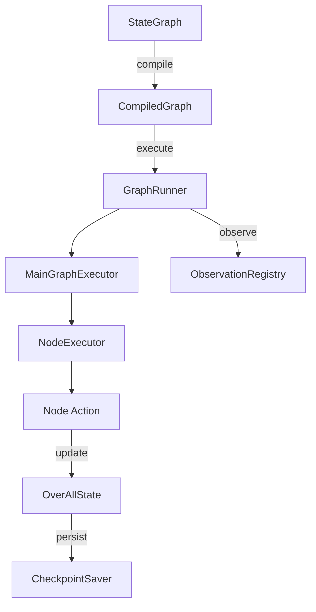

# Spring AI Alibaba Graph-Core 模块专项分析

> **版本**: 1.0  
> **作者**: Spring AI Alibaba Team  
> **最后更新**: 2025-10-02

---

## 📑 目录

1. [模块概述](#1-模块概述)
2. [架构设计](#2-架构设计)
3. [核心概念](#3-核心概念)
4. [StateGraph 详解](#4-stategraph-详解)
5. [CompiledGraph 执行引擎](#5-compiledgraph-执行引擎)
6. [状态管理系统](#6-状态管理系统)
7. [Checkpoint 持久化机制](#7-checkpoint-持久化机制)
8. [Agent 框架](#8-agent-框架)
9. [节点系统](#9-节点系统)
10. [异步执行与流式处理](#10-异步执行与流式处理)
11. [可观测性集成](#11-可观测性集成)
12. [高级特性](#12-高级特性)
13. [最佳实践](#13-最佳实践)
14. [配置指南](#14-配置指南)

---

## 1. 模块概述

### 1.1 什么是 Graph-Core

`spring-ai-alibaba-graph-core` 是一个强大的**有状态多智能体应用框架**，受 [LangGraph](https://github.com/langchain-ai/langgraph) 启发，提供了在 Spring 生态系统中构建复杂 AI 工作流的能力。

**核心特性**：
- 🔄 **有向无环图 (DAG)** 工作流编排
- 📊 **状态管理** 贯穿整个执行流程
- 🔁 **循环支持** 实现迭代式 AI 任务
- 💾 **Checkpoint** 持久化，支持暂停/恢复
- 🎯 **条件路由** 根据状态动态选择执行路径
- ⚡ **并行执行** 多节点同时运行
- 🔍 **可观测性** 全链路追踪和监控
- 🤖 **Agent 抽象** 提供 ReactAgent 和 ReflectAgent

### 1.2 模块依赖

```xml
<dependencies>
    <!-- Reactive 支持 -->
    <dependency>
        <groupId>io.projectreactor</groupId>
        <artifactId>reactor-core</artifactId>
    </dependency>
    
    <!-- Spring AI 核心 -->
    <dependency>
        <groupId>org.springframework.ai</groupId>
        <artifactId>spring-ai-commons</artifactId>
    </dependency>
    
    <!-- 核心模块 -->
    <dependency>
        <groupId>com.alibaba.cloud.ai</groupId>
        <artifactId>spring-ai-alibaba-core</artifactId>
    </dependency>
    
    <!-- A2A 协议支持 -->
    <dependency>
        <groupId>io.github.a2asdk</groupId>
        <artifactId>a2a-java-sdk-client</artifactId>
    </dependency>
    
    <!-- MCP 协议支持 -->
    <dependency>
        <groupId>io.modelcontextprotocol.sdk</groupId>
        <artifactId>mcp</artifactId>
    </dependency>
    
    <!-- 数据序列化 -->
    <dependency>
        <groupId>com.fasterxml.jackson.core</groupId>
        <artifactId>jackson-databind</artifactId>
    </dependency>
    
    <!-- 可选：Redis 持久化 -->
    <dependency>
        <groupId>org.redisson</groupId>
        <artifactId>redisson</artifactId>
        <optional>true</optional>
    </dependency>
    
    <!-- 可选：MongoDB 持久化 -->
    <dependency>
        <groupId>org.mongodb</groupId>
        <artifactId>mongodb-driver-sync</artifactId>
        <optional>true</optional>
    </dependency>
</dependencies>
```

---

## 2. 架构设计

### 2.1 整体架构

```
┌─────────────────────────────────────────────────────────────┐
│                     Graph Application Layer                  │
│        (ReactAgent, ReflectAgent, Custom Workflows)          │
└─────────────────────────────────────────────────────────────┘
                            ↓
┌─────────────────────────────────────────────────────────────┐
│                    Graph Compilation Layer                   │
│            StateGraph → CompiledGraph (优化 & 校验)         │
└─────────────────────────────────────────────────────────────┘
                            ↓
┌─────────────────────────────────────────────────────────────┐
│                    Execution Engine Layer                    │
│         MainGraphExecutor → NodeExecutor (并行执行)         │
└─────────────────────────────────────────────────────────────┘
                            ↓
┌─────────────────────────────────────────────────────────────┐
│                    State Management Layer                    │
│      OverAllState + KeyStrategy + Channel + Reducer         │
└─────────────────────────────────────────────────────────────┘
                            ↓
┌─────────────────────────────────────────────────────────────┐
│                  Persistence & Observability                 │
│      CheckpointSaver (Memory/File/Redis/Mongo) + Metrics    │
└─────────────────────────────────────────────────────────────┘
```

### 2.2 核心组件关系



---

## 3. 核心概念

### 3.1 StateGraph（状态图）

**StateGraph** 是构建工作流的起点，定义了节点、边和状态管理策略。

**核心方法**：

```java
public class StateGraph {
    // 添加节点
    public StateGraph addNode(String id, AsyncNodeAction action);
    
    // 添加边（固定路由）
    public StateGraph addEdge(String sourceId, String targetId);
    
    // 添加条件边（动态路由）
    public StateGraph addConditionalEdges(String sourceId, 
                                         AsyncCommandAction condition, 
                                         Map<String, String> mappings);
    
    // 添加子图
    public StateGraph addNode(String id, CompiledGraph subGraph);
    
    // 编译为可执行图
    public CompiledGraph compile(CompileConfig config);
}
```

**特殊节点标识符**：
- `START` (`__START__`): 图的入口点
- `END` (`__END__`): 图的终点
- `ERROR` (`__ERROR__`): 错误处理节点
- `NODE_BEFORE` / `NODE_AFTER`: 生命周期钩子

### 3.2 OverAllState（全局状态）

**OverAllState** 是所有节点共享的状态容器，支持灵活的状态更新策略。

```java
public final class OverAllState implements Serializable {
    // 状态数据
    private final Map<String, Object> data;
    
    // 键值更新策略
    private final Map<String, KeyStrategy> keyStrategies;
    
    // 恢复标志
    private Boolean resume;
    
    // 人类反馈
    private HumanFeedback humanFeedback;
    
    // 中断消息
    private String interruptMessage;
    
    // 长期存储
    private Store store;
}
```

**状态更新策略 (KeyStrategy)**：

| 策略类型 | 说明 | 使用场景 |
|---------|------|---------|
| `ReplaceStrategy` | 直接替换旧值 | 单一结果字段 (如 `answer`) |
| `AppenderStrategy` | 追加到列表 | 消息历史 (`messages`) |
| `ReducerStrategy` | 自定义合并逻辑 | 复杂对象聚合 |

**示例**：

```java
// 创建状态并注册策略
OverAllState state = new OverAllState();
state.registerKeyAndStrategy("messages", new AppenderStrategy());
state.registerKeyAndStrategy("answer", new ReplaceStrategy());

// 更新状态
Map<String, Object> update = Map.of(
    "messages", List.of(new UserMessage("Hello")),
    "answer", "Response from AI"
);
state.updateState(update);
```

### 3.3 Node（节点）

**Node** 是工作流的执行单元，封装了具体的业务逻辑。

**节点类型**：

```java
// 1. 基本节点 - 同步/异步 Action
StateGraph graph = new StateGraph();
graph.addNode("llm", (state, config) -> {
    // 调用 LLM
    String response = chatModel.call(state.value("messages"));
    return CompletableFuture.completedFuture(Map.of("answer", response));
});

// 2. 内置节点 - LlmNode
LlmNode llmNode = LlmNode.builder()
    .chatModel(chatModel)
    .messageKey("messages")
    .outputKey("answer")
    .build();
graph.addNode("llm", llmNode);

// 3. 并行节点 - ParallelNode (自动创建)
graph.addEdge(START, "node1");
graph.addEdge(START, "node2");  // 自动合并为并行节点

// 4. 子图节点
StateGraph subGraph = new StateGraph();
// ... 定义子图
graph.addNode("subgraph", subGraph.compile());
```

**常用内置节点**：

| 节点类型 | 说明 |
|---------|------|
| `LlmNode` | 调用 LLM 模型 |
| `ToolNode` | 执行工具调用 |
| `McpNode` | 调用 MCP Server |
| `AgentNode` | 嵌套 Agent |
| `HumanNode` | 等待人类输入 |
| `AnswerNode` | 生成最终答案 |
| `KnowledgeRetrievalNode` | RAG 检索 |

### 3.4 Edge（边）

**Edge** 定义了节点之间的执行流转。

```java
// 固定边 - 总是路由到下一个节点
graph.addEdge("node1", "node2");

// 条件边 - 根据状态动态路由
graph.addConditionalEdges("node1", (state, config) -> {
    if (state.value("should_continue").get().equals(true)) {
        return CompletableFuture.completedFuture(new Command("node2"));
    }
    return CompletableFuture.completedFuture(new Command(END));
}, Map.of(
    "node2", "node2",
    END, END
));
```

---

## 4. StateGraph 详解

### 4.1 StateGraph 完整源码结构

```java
public class StateGraph {
    // 节点集合
    final Nodes nodes = new Nodes();
    
    // 边集合
    final Edges edges = new Edges();
    
    // 键策略工厂
    private KeyStrategyFactory keyStrategyFactory;
    
    // 图名称
    private String name;
    
    // 状态序列化器
    private final StateSerializer stateSerializer;
    
    // 内部类：节点容器
    public static class Nodes {
        public final Set<Node> elements;
        
        public boolean anyMatchById(String id);
        public List<SubStateGraphNode> onlySubStateGraphNodes();
        public List<Node> exceptSubStateGraphNodes();
    }
    
    // 内部类：边容器
    public static class Edges {
        public final List<Edge> elements;
        
        public Optional<Edge> edgeBySourceId(String sourceId);
        public List<Edge> edgesByTargetId(String targetId);
    }
}
```

### 4.2 构建工作流示例

**示例 1：简单线性流程**

```java
StateGraph graph = new StateGraph();

// 定义节点
graph.addNode("input", (state, config) -> 
    CompletableFuture.completedFuture(Map.of("user_query", "What is AI?")));

graph.addNode("llm", (state, config) -> {
    String query = (String) state.value("user_query").get();
    String answer = chatModel.call(query);
    return CompletableFuture.completedFuture(Map.of("answer", answer));
});

graph.addNode("output", (state, config) -> {
    System.out.println("Answer: " + state.value("answer").get());
    return CompletableFuture.completedFuture(Map.of());
});

// 定义边
graph.addEdge(START, "input");
graph.addEdge("input", "llm");
graph.addEdge("llm", "output");
graph.addEdge("output", END);

// 编译执行
CompiledGraph compiled = graph.compile();
compiled.call(Map.of());
```

**示例 2：条件路由（RAG vs 直接回答）**

```java
StateGraph graph = new StateGraph();

graph.addNode("classifier", (state, config) -> {
    String query = (String) state.value("user_query").get();
    boolean needsKnowledge = queryNeedsKnowledge(query);
    return CompletableFuture.completedFuture(
        Map.of("needs_knowledge", needsKnowledge)
    );
});

graph.addNode("rag", (state, config) -> {
    // 检索知识库
    List<Document> docs = vectorStore.search(state.value("user_query").get());
    return CompletableFuture.completedFuture(Map.of("context", docs));
});

graph.addNode("answer", (state, config) -> {
    // 生成答案
    String answer = chatModel.call(buildPrompt(state));
    return CompletableFuture.completedFuture(Map.of("answer", answer));
});

// 路由逻辑
graph.addEdge(START, "classifier");
graph.addConditionalEdges("classifier", (state, config) -> {
    boolean needsKnowledge = (boolean) state.value("needs_knowledge").get();
    return CompletableFuture.completedFuture(
        new Command(needsKnowledge ? "rag" : "answer")
    );
}, Map.of("rag", "rag", "answer", "answer"));

graph.addEdge("rag", "answer");
graph.addEdge("answer", END);
```

**示例 3：循环迭代（ReAct Agent）**

```java
StateGraph graph = new StateGraph(() -> {
    Map<String, KeyStrategy> strategies = new HashMap<>();
    strategies.put("messages", new AppenderStrategy());
    strategies.put("iterations", new ReplaceStrategy());
    return strategies;
});

graph.addNode("llm", llmNode);
graph.addNode("tool", toolNode);

graph.addEdge(START, "llm");

// 条件边：根据 LLM 响应决定是否继续工具调用
graph.addConditionalEdges("llm", (state, config) -> {
    List<Message> messages = (List<Message>) state.value("messages").get();
    AssistantMessage lastMsg = (AssistantMessage) messages.get(messages.size() - 1);
    
    if (lastMsg.hasToolCalls()) {
        return CompletableFuture.completedFuture(new Command("tool"));
    }
    return CompletableFuture.completedFuture(new Command(END));
}, Map.of("tool", "tool", END, END));

graph.addEdge("tool", "llm");  // 循环回 LLM

// 编译配置最大迭代次数
CompileConfig config = CompileConfig.builder()
    .maxIterations(10)
    .build();
CompiledGraph compiled = graph.compile(config);
```

### 4.3 图验证

StateGraph 在编译前会进行严格验证：

```java
void validateGraph() throws GraphStateException {
    // 1. 验证所有节点
    for (var node : nodes.elements) {
        node.validate();
    }
    
    // 2. 验证入口点存在
    var edgeStart = edges.edgeBySourceId(START)
        .orElseThrow(Errors.missingEntryPoint::exception);
    
    // 3. 验证所有边的目标节点存在
    for (Edge edge : edges.elements) {
        edge.validate(nodes);
    }
}
```

**常见错误**：
- `Missing entry point`: 缺少 START 边
- `Invalid node identifier`: 使用了保留标识符（如 END）
- `Duplicate node error`: 节点 ID 重复
- `Missing node in edge mapping`: 条件边映射的目标节点不存在

---

## 5. CompiledGraph 执行引擎

### 5.1 编译过程

**StateGraph → CompiledGraph 转换**：

```java
protected CompiledGraph(StateGraph stateGraph, CompileConfig compileConfig) {
    this.stateGraph = stateGraph;
    this.keyStrategyMap = stateGraph.getKeyStrategyFactory().apply();
    
    // 处理节点和边（展平子图、合并并行节点）
    this.processedData = ProcessedNodesEdgesAndConfig.process(stateGraph, compileConfig);
    
    // 验证中断点
    for (String interruption : processedData.interruptsBefore()) {
        if (!processedData.nodes().anyMatchById(interruption)) {
            throw Errors.interruptionNodeNotExist.exception(interruption);
        }
    }
    
    // 实例化节点 Actions
    for (var n : processedData.nodes().elements) {
        nodes.put(n.id(), n.actionFactory().apply(compileConfig));
    }
    
    // 处理边（包括并行边）
    for (var e : processedData.edges().elements) {
        if (e.targets().size() == 1) {
            edges.put(e.sourceId(), e.targets().get(0));
        } else {
            // 创建并行节点
            var parallelNode = new ParallelNode(e.sourceId(), actions, keyStrategyMap, compileConfig);
            nodes.put(parallelNode.id(), parallelNode.actionFactory().apply(compileConfig));
            edges.put(e.sourceId(), new EdgeValue(parallelNode.id()));
        }
    }
}
```

### 5.2 执行模式

**同步执行**：

```java
// 阻塞等待最终结果
Optional<OverAllState> result = compiledGraph.call(
    Map.of("input", "Hello"),
    RunnableConfig.builder().build()
);

OverAllState finalState = result.get();
System.out.println(finalState.value("answer").get());
```

**流式执行**：

```java
// 实时获取每个节点的输出
Flux<NodeOutput> stream = compiledGraph.fluxStream(
    Map.of("input", "Hello"),
    RunnableConfig.builder().build()
);

stream.subscribe(nodeOutput -> {
    System.out.println("Node: " + nodeOutput.node());
    System.out.println("State: " + nodeOutput.state().data());
});
```

**异步生成器**：

```java
// 支持暂停/恢复的迭代器
AsyncGenerator<NodeOutput> generator = compiledGraph.asyncStream(
    Map.of("input", "Hello")
);

while (generator.hasNext().get()) {
    NodeOutput output = generator.next().get();
    // 处理输出
}

// 可以随时关闭
generator.close();
```

### 5.3 执行引擎架构

**MainGraphExecutor + NodeExecutor 协作**：

```java
public class MainGraphExecutor extends BaseGraphExecutor {
    private final NodeExecutor nodeExecutor;
    
    @Override
    public Flux<GraphResponse<NodeOutput>> execute(
        GraphRunnerContext context, 
        AtomicReference<Object> resultValue
    ) {
        // 检查终止条件
        if (context.shouldStop() || context.isMaxIterationsReached()) {
            return handleCompletion(context, resultValue);
        }
        
        // 处理中断恢复
        if (context.shouldInterrupt()) {
            return Flux.just(GraphResponse.done(InterruptionMetadata.builder(...).build()));
        }
        
        // 委托给 NodeExecutor
        return nodeExecutor.execute(context, resultValue);
    }
}

public class NodeExecutor extends BaseGraphExecutor {
    @Override
    public Flux<GraphResponse<NodeOutput>> execute(...) {
        // 执行节点 Action
        AsyncNodeActionWithConfig action = context.getNodeAction(currentNodeId);
        CompletableFuture<Map<String, Object>> future = action.apply(state, config);
        
        return Mono.fromFuture(future)
            .flatMapMany(updateState -> {
                // 更新状态
                context.mergeIntoCurrentState(updateState);
                
                // 确定下一个节点
                Command nextCommand = context.nextNodeId(currentNodeId, currentState);
                context.setNextNodeId(nextCommand.gotoNode());
                
                // 递归调用 MainGraphExecutor
                return Flux.just(GraphResponse.of(nodeOutput))
                    .concatWith(mainGraphExecutor.execute(context, resultValue));
            });
    }
}
```

**关键特性**：
- **尾递归优化**: 通过 Flux 延迟执行避免栈溢出
- **回压控制**: Reactor 自动处理流量控制
- **错误隔离**: 单个节点失败不会影响整个流

---

## 6. 状态管理系统

### 6.1 OverAllState 内部结构

```java
public final class OverAllState implements Serializable {
    // 核心数据存储
    private final Map<String, Object> data;
    
    // 更新策略映射
    private final Map<String, KeyStrategy> keyStrategies;
    
    // 恢复标志（用于 checkpoint 恢复）
    private Boolean resume;
    
    // 人类反馈（HumanNode）
    private HumanFeedback humanFeedback;
    
    // 中断消息
    private String interruptMessage;
    
    // 长期存储（跨会话）
    private Store store;
    
    // 默认输入键
    public static final String DEFAULT_INPUT_KEY = "input";
}
```

### 6.2 状态更新机制

**核心方法**：

```java
public Map<String, Object> updateState(Map<String, Object> partialState) {
    // 遍历部分状态
    for (Map.Entry<String, Object> entry : partialState.entrySet()) {
        String key = entry.getKey();
        Object newValue = entry.getValue();
        
        // 获取对应的更新策略
        KeyStrategy strategy = keyStrategies.get(key);
        if (strategy != null) {
            // 应用策略合并旧值和新值
            Object currentValue = data.get(key);
            Object mergedValue = strategy.apply(currentValue, newValue);
            data.put(key, mergedValue);
        }
    }
    return data;
}
```

**KeyStrategy 接口**：

```java
@FunctionalInterface
public interface KeyStrategy extends Serializable {
    /**
     * 应用更新策略
     * @param currentValue 当前值
     * @param newValue 新值
     * @return 合并后的值
     */
    Object apply(Object currentValue, Object newValue);
}
```

**内置策略实现**：

```java
// 1. 替换策略
public class ReplaceStrategy implements KeyStrategy {
    @Override
    public Object apply(Object currentValue, Object newValue) {
        return newValue;  // 直接替换
    }
}

// 2. 追加策略
public class AppenderStrategy implements KeyStrategy {
    @Override
    public Object apply(Object currentValue, Object newValue) {
        List<Object> result = new ArrayList<>();
        if (currentValue instanceof List) {
            result.addAll((List<?>) currentValue);
        }
        if (newValue instanceof List) {
            result.addAll((List<?>) newValue);
        } else if (newValue != null) {
            result.add(newValue);
        }
        return result;
    }
}

// 3. 自定义 Reducer
public class CustomReducer implements Reducer {
    @Override
    public Object apply(Object left, Object right) {
        // 自定义合并逻辑
        if (left instanceof Map && right instanceof Map) {
            Map<String, Object> merged = new HashMap<>((Map<String, Object>) left);
            merged.putAll((Map<String, Object>) right);
            return merged;
        }
        return right;
    }
}
```

### 6.3 Channel（高级状态管理）

**Channel** 提供类型安全的状态访问和更新：

```java
// 定义 Channel
public class MessagesChannel extends AppenderChannel<List<Message>> {
    public MessagesChannel() {
        super("messages");
    }
    
    @Override
    public List<Message> getDefault() {
        return new ArrayList<>();
    }
}

// 使用 Channel
MessagesChannel messagesChannel = new MessagesChannel();
OverAllState state = new OverAllState();

// 注册 Channel
state.registerKeyAndStrategy(messagesChannel.name(), messagesChannel.strategy());

// 读取
List<Message> messages = messagesChannel.read(state);

// 更新
messagesChannel.write(state, List.of(new UserMessage("Hello")));
```

### 6.4 Store（长期记忆）

**Store** 允许跨会话持久化状态：

```java
// 创建带 Store 的状态
Store memoryStore = new InMemoryStore();
OverAllState state = new OverAllState(memoryStore);

// 保存到 Store
StoreItem item = StoreItem.builder()
    .namespace("user_preferences")
    .key("theme")
    .value("dark")
    .build();
memoryStore.put(item);

// 从 Store 读取
List<StoreItem> items = memoryStore.search(
    StoreSearchRequest.builder()
        .namespace("user_preferences")
        .query("theme")
        .build()
);
```

---

## 7. Checkpoint 持久化机制

### 7.1 Checkpoint 核心概念

**Checkpoint** 记录图执行的每个阶段状态，支持：
- ✅ 暂停/恢复执行
- ✅ 时间旅行调试
- ✅ 分支对话
- ✅ 故障恢复

**Checkpoint 结构**：

```java
public class Checkpoint implements HasVersions, Serializable {
    // 唯一标识符
    private final String id;
    
    // 完整状态数据
    private final Map<String, Object> state;
    
    // 下一个要执行的节点
    private final String nextNodeId;
    
    // 版本号（用于并发控制）
    private final int versionCounter;
    
    // 父 Checkpoint ID（用于分支）
    private final String parentId;
    
    // 创建时间
    private final long ts;
}
```

### 7.2 CheckpointSaver 实现

**接口定义**：

```java
public interface BaseCheckpointSaver {
    // 列出所有 Checkpoints
    Collection<Checkpoint> list(RunnableConfig config);
    
    // 获取最新 Checkpoint
    Optional<Checkpoint> get(RunnableConfig config);
    
    // 保存 Checkpoint
    RunnableConfig put(RunnableConfig config, Checkpoint checkpoint) throws Exception;
    
    // 清除 Checkpoints
    boolean clear(RunnableConfig config);
    
    // 释放 Checkpoints（创建快照）
    Tag release(RunnableConfig config) throws Exception;
}
```

**内置实现**：

| 实现类 | 存储介质 | 适用场景 |
|--------|---------|---------|
| `MemorySaver` | 内存 | 开发测试 |
| `FileSystemSaver` | 本地文件 | 单机部署 |
| `RedisSaver` | Redis | 分布式部署 |
| `MongoSaver` | MongoDB | 持久化存储 |

**使用示例**：

```java
// 1. MemorySaver（默认）
CompiledGraph graph = stateGraph.compile();

// 2. FileSystemSaver
SaverConfig saverConfig = SaverConfig.builder()
    .register(SaverEnum.FILE_SYSTEM.getValue(), 
              new FileSystemSaver(Paths.get("./checkpoints"), stateSerializer))
    .build();
CompileConfig config = CompileConfig.builder()
    .saverConfig(saverConfig)
    .build();
CompiledGraph graph = stateGraph.compile(config);

// 3. RedisSaver
RedissonClient redisson = Redisson.create(redisConfig);
SaverConfig saverConfig = SaverConfig.builder()
    .register(SaverEnum.REDIS.getValue(), new RedisSaver(redisson))
    .build();

// 4. MongoSaver
MongoClient mongoClient = MongoClients.create("mongodb://localhost:27017");
SaverConfig saverConfig = SaverConfig.builder()
    .register(SaverEnum.MONGO.getValue(), new MongoSaver(mongoClient))
    .build();
```

### 7.3 暂停与恢复

**暂停执行（Interruption）**：

```java
// 配置中断点
CompileConfig config = CompileConfig.builder()
    .interruptsBefore("human_review")  // 在节点执行前中断
    .interruptsAfter("data_processing")  // 在节点执行后中断
    .build();

CompiledGraph graph = stateGraph.compile(config);

// 执行会在中断点暂停
RunnableConfig runConfig = RunnableConfig.builder()
    .threadId("conversation-123")
    .build();
Optional<OverAllState> result = graph.call(Map.of("input", "..."), runConfig);

// 获取当前状态
StateSnapshot snapshot = graph.getState(runConfig);
System.out.println("Paused at node: " + snapshot.next());
```

**恢复执行**：

```java
// 提供人类反馈后恢复
OverAllState.HumanFeedback feedback = new OverAllState.HumanFeedback(
    "Approved",
    Map.of("decision", "continue")
);

RunnableConfig resumeConfig = RunnableConfig.builder()
    .threadId("conversation-123")
    .build();

Optional<OverAllState> result = graph.resume(feedback, resumeConfig);
```

**更新状态后继续**：

```java
// 修改状态后继续执行
RunnableConfig updatedConfig = graph.updateState(
    runConfig, 
    Map.of("user_feedback", "Looks good!"),
    "next_node"  // 指定从哪个节点继续
);

Optional<OverAllState> result = graph.call(Map.of(), updatedConfig);
```

### 7.4 时间旅行与分支

**获取状态历史**：

```java
Collection<StateSnapshot> history = graph.getStateHistory(runConfig);

for (StateSnapshot snapshot : history) {
    System.out.println("Step: " + snapshot.metadata());
    System.out.println("State: " + snapshot.state().data());
    System.out.println("---");
}
```

**从历史点分支**：

```java
// 获取特定 Checkpoint
StateSnapshot snapshot = graph.getState(runConfig);
String checkpointId = snapshot.config().checkPointId().get();

// 创建分支配置
RunnableConfig branchConfig = RunnableConfig.builder()
    .threadId("conversation-123-branch")
    .checkPointId(checkpointId)
    .build();

// 从该点继续执行（不影响原会话）
Optional<OverAllState> branchResult = graph.call(
    Map.of("alternative_input", "..."),
    branchConfig
);
```

---

## 8. Agent 框架

### 8.1 Agent 抽象

**Agent 基类**：

```java
public abstract class Agent {
    // Agent 唯一名称
    protected String name;
    
    // 能力描述（用于多 Agent 协作）
    protected String description;
    
    // 编译配置
    protected CompileConfig compileConfig;
    
    // 编译后的图
    protected volatile CompiledGraph compiledGraph;
    
    // 状态图
    protected volatile StateGraph graph;
    
    // 获取/编译图
    public StateGraph getGraph();
    public CompiledGraph getAndCompileGraph();
    
    // 执行方法（子类实现）
    public abstract Optional<OverAllState> invoke(Map<String, Object> inputs, RunnableConfig config);
}
```

### 8.2 ReactAgent（工具调用 Agent）

**ReactAgent** 实现了经典的 ReAct (Reasoning + Acting) 模式。

**架构**：

```
START → LLM Node → [有工具调用?] → Tool Node → LLM Node (循环)
                         ↓ 否
                        END
```

**使用示例**：

```java
// 1. 定义工具
List<ToolCallback> tools = List.of(
    ToolCallback.builder()
        .name("search")
        .description("Search the web for information")
        .inputType(SearchInput.class)
        .function(this::searchWeb)
        .build(),
    
    ToolCallback.builder()
        .name("calculator")
        .description("Perform mathematical calculations")
        .inputType(CalculatorInput.class)
        .function(this::calculate)
        .build()
);

// 2. 创建 ReactAgent
ReactAgent agent = ReactAgent.builder()
    .name("my-agent")
    .description("A helpful AI assistant")
    .chatModel(chatModel)
    .tools(tools)
    .maxIterations(10)
    .build();

// 3. 执行
AssistantMessage result = agent.invoke("What is 25 * 4 + 10?");
System.out.println(result.getText());  // "110"
```

**流式执行**：

```java
Flux<NodeOutput> stream = agent.stream("Search for latest AI news");

stream.subscribe(output -> {
    if ("llm".equals(output.node())) {
        System.out.println("AI思考: " + output.state().value("messages").get());
    } else if ("tool".equals(output.node())) {
        System.out.println("执行工具: " + output.state().value("tool_calls").get());
    }
});
```

**自定义 Hook**：

```java
ReactAgent agent = ReactAgent.builder()
    .chatModel(chatModel)
    .tools(tools)
    .preLlmHook((state, config) -> {
        // LLM 调用前预处理
        System.out.println("准备调用 LLM...");
        return CompletableFuture.completedFuture(Map.of());
    })
    .postToolHook((state, config) -> {
        // 工具调用后处理
        System.out.println("工具执行完成");
        return CompletableFuture.completedFuture(Map.of());
    })
    .build();
```

### 8.3 ReflectAgent（反思 Agent）

**ReflectAgent** 通过自我反思迭代改进答案。

**架构**：

```
START → Graph Node → [达到最大迭代?] → Reflection Node → [是助手消息?]
                          ↓ 否                                    ↓ 是
                       Reflection                                END
                          ↓ 循环回 Graph
```

**使用示例**：

```java
// 1. 定义主任务节点
NodeAction graphNode = (state, config) -> {
    List<Message> messages = (List<Message>) state.value("messages").get();
    Message response = chatModel.call(new Prompt(messages));
    return CompletableFuture.completedFuture(
        Map.of("messages", List.of(response))
    );
};

// 2. 定义反思节点
NodeAction reflectionNode = (state, config) -> {
    List<Message> messages = (List<Message>) state.value("messages").get();
    
    // 构造反思 Prompt
    String reflectionPrompt = """
        Review the previous response. What can be improved?
        Provide specific feedback.
        """;
    
    Message feedback = chatModel.call(reflectionPrompt);
    return CompletableFuture.completedFuture(
        Map.of("messages", List.of(feedback))
    );
};

// 3. 创建 ReflectAgent
ReflectAgent agent = ReflectAgent.builder()
    .name("reflect-agent")
    .graph(graphNode)
    .reflection(reflectionNode)
    .maxIterations(3)
    .build();

// 4. 执行
CompiledGraph compiled = agent.getAndCompileGraph();
Optional<OverAllState> result = compiled.call(
    Map.of("messages", List.of(new UserMessage("Write a poem about AI")))
);

// 查看反思过程
List<Message> messages = (List<Message>) result.get().value("messages").get();
for (Message msg : messages) {
    System.out.println(msg.getMessageType() + ": " + msg.getText());
}
```

**输出示例**：

```
USER: Write a poem about AI
ASSISTANT: AI is smart and bright, helping day and night...
USER: (Reflection) The poem is too simple. Add more depth and metaphor.
ASSISTANT: In silicon dreams where neurons dance, algorithms learn...
USER: (Reflection) Better, but could use more emotion.
ASSISTANT: Through circuits woven with human thought, compassion taught...
```

---

## 9. 节点系统

### 9.1 内置节点类型

**LlmNode（LLM 调用节点）**：

```java
LlmNode llmNode = LlmNode.builder()
    .chatModel(chatModel)
    .messageKey("messages")
    .outputKey("ai_message")
    .systemPrompt("You are a helpful assistant")
    .build();

graph.addNode("llm", llmNode);
```

**ToolNode（工具执行节点）**：

```java
List<ToolCallback> tools = List.of(...);

ToolNode toolNode = ToolNode.builder()
    .tools(tools)
    .messageKey("messages")
    .toolCallsKey("tool_calls")
    .build();

graph.addNode("tool", toolNode);
```

**McpNode（MCP 服务调用）**：

```java
McpNode mcpNode = McpNode.builder()
    .mcpClient(mcpSyncClient)
    .serverName("weather-service")
    .toolName("get_weather")
    .inputKey("location")
    .outputKey("weather_data")
    .build();

graph.addNode("mcp", mcpNode);
```

**HumanNode（人工介入节点）**：

```java
HumanNode humanNode = HumanNode.builder()
    .questionKey("review_question")
    .feedbackKey("human_feedback")
    .timeoutSeconds(300)
    .build();

graph.addNode("human", humanNode);

// 配置中断
CompileConfig config = CompileConfig.builder()
    .interruptsBefore("human")
    .build();

CompiledGraph compiled = graph.compile(config);

// 执行会在 human 节点前暂停
Optional<OverAllState> paused = compiled.call(Map.of(...), runConfig);

// 提供反馈后恢复
Optional<OverAllState> resumed = compiled.resume(
    new OverAllState.HumanFeedback("approved", Map.of()),
    runConfig
);
```

**KnowledgeRetrievalNode（RAG 检索）**：

```java
KnowledgeRetrievalNode ragNode = KnowledgeRetrievalNode.builder()
    .vectorStore(vectorStore)
    .queryKey("user_query")
    .contextKey("retrieved_docs")
    .topK(5)
    .similarityThreshold(0.7)
    .build();

graph.addNode("rag", ragNode);
```

**AnswerNode（答案生成节点）**：

```java
AnswerNode answerNode = AnswerNode.builder()
    .chatModel(chatModel)
    .contextKey("retrieved_docs")
    .questionKey("user_query")
    .answerKey("final_answer")
    .promptTemplate("""
        Based on the following context:
        {context}
        
        Answer the question: {question}
        """)
    .build();

graph.addNode("answer", answerNode);
```

### 9.2 并行节点（ParallelNode）

**自动创建**：

```java
StateGraph graph = new StateGraph();

graph.addNode("task1", task1Action);
graph.addNode("task2", task2Action);
graph.addNode("task3", task3Action);
graph.addNode("merge", mergeAction);

// 多条边指向同一起点 → 自动创建并行节点
graph.addEdge(START, "task1");
graph.addEdge(START, "task2");
graph.addEdge(START, "task3");

// 所有并行任务完成后汇聚
graph.addEdge("task1", "merge");
graph.addEdge("task2", "merge");
graph.addEdge("task3", "merge");

CompiledGraph compiled = graph.compile();
```

**并行执行机制**：

```java
public class ParallelNode extends Node {
    private final List<AsyncNodeActionWithConfig> actions;
    private final Map<String, KeyStrategy> keyStrategyMap;
    
    @Override
    public CompletableFuture<Map<String, Object>> execute(OverAllState state, RunnableConfig config) {
        // 并行执行所有 actions
        List<CompletableFuture<Map<String, Object>>> futures = actions.stream()
            .map(action -> action.apply(state, config))
            .toList();
        
        // 等待所有完成
        return CompletableFuture.allOf(futures.toArray(new CompletableFuture[0]))
            .thenApply(v -> {
                // 合并所有结果
                Map<String, Object> mergedState = new HashMap<>();
                for (CompletableFuture<Map<String, Object>> future : futures) {
                    Map<String, Object> partialState = future.join();
                    mergedState = OverAllState.updateState(mergedState, partialState, keyStrategyMap);
                }
                return mergedState;
            });
    }
}
```

### 9.3 子图节点（SubGraphNode）

```java
// 创建子图
StateGraph subGraph = new StateGraph();
subGraph.addNode("sub1", sub1Action);
subGraph.addNode("sub2", sub2Action);
subGraph.addEdge(START, "sub1");
subGraph.addEdge("sub1", "sub2");
subGraph.addEdge("sub2", END);

// 编译子图
CompiledGraph compiledSubGraph = subGraph.compile();

// 在父图中使用
StateGraph parentGraph = new StateGraph();
parentGraph.addNode("parent1", parent1Action);
parentGraph.addNode("subgraph", compiledSubGraph);  // 嵌入子图
parentGraph.addNode("parent2", parent2Action);

parentGraph.addEdge(START, "parent1");
parentGraph.addEdge("parent1", "subgraph");
parentGraph.addEdge("subgraph", "parent2");
parentGraph.addEdge("parent2", END);
```

---

## 10. 异步执行与流式处理

### 10.1 异步生成器（AsyncGenerator）

**AsyncGenerator** 提供可控的迭代式执行：

```java
// 创建异步生成器
AsyncGenerator<NodeOutput> generator = compiledGraph.asyncStream(
    Map.of("input", "Hello")
);

// 迭代方式 1：手动迭代
while (generator.hasNext().get()) {
    NodeOutput output = generator.next().get();
    System.out.println("Node: " + output.node());
    
    // 可以随时暂停
    if (shouldPause(output)) {
        break;
    }
}

// 稍后继续
while (generator.hasNext().get()) {
    NodeOutput output = generator.next().get();
    // ...
}

// 关闭生成器
generator.close();

// 迭代方式 2：流式处理
generator.stream()
    .filter(output -> !"__START__".equals(output.node()))
    .subscribe(output -> {
        // 处理每个输出
    });
```

**AsyncGenerator 内部实现**：

```java
public interface AsyncGenerator<T> extends Closeable {
    // 检查是否有下一个元素
    CompletableFuture<Boolean> hasNext();
    
    // 获取下一个元素
    CompletableFuture<T> next();
    
    // 转换为 Flux 流
    Flux<T> stream();
    
    // 关闭生成器
    @Override
    void close();
}
```

### 10.2 Flux 流式处理

**Flux 响应式流**：

```java
Flux<NodeOutput> stream = compiledGraph.fluxStream(
    Map.of("input", "Analyze this data")
);

stream
    // 过滤特定节点
    .filter(output -> "llm".equals(output.node()))
    
    // 转换输出
    .map(output -> {
        String message = (String) output.state().value("ai_message").get();
        return new ProcessedOutput(output.node(), message);
    })
    
    // 错误处理
    .onErrorResume(error -> {
        log.error("Execution failed", error);
        return Flux.empty();
    })
    
    // 订阅
    .subscribe(
        output -> System.out.println("处理: " + output),
        error -> System.err.println("错误: " + error),
        () -> System.out.println("完成")
    );
```

**背压处理**：

```java
// 限制并发处理
stream
    .limitRate(10)  // 每次最多请求 10 个元素
    .delayElements(Duration.ofMillis(100))  // 限流
    .subscribe(...);

// 缓冲处理
stream
    .buffer(Duration.ofSeconds(1), 50)  // 每秒或50个元素批次
    .flatMap(batch -> processBatch(batch))
    .subscribe(...);
```

### 10.3 流式输出（StreamingOutput）

**支持 SSE 流式输出**：

```java
// 定义流式节点
graph.addNode("streaming_llm", (state, config) -> {
    Flux<String> tokenStream = chatModel.stream(prompt);
    
    // 返回 StreamingOutput
    StreamingOutput<String> output = StreamingOutput.of(
        tokenStream,
        "ai_message"
    );
    
    return CompletableFuture.completedFuture(
        Map.of("streaming_output", output)
    );
});

// 执行并处理流式输出
Flux<NodeOutput> stream = compiledGraph.fluxStream(Map.of(...));

stream.subscribe(nodeOutput -> {
    if (nodeOutput.state().data().containsKey("streaming_output")) {
        StreamingOutput<String> streamingOutput = 
            (StreamingOutput<String>) nodeOutput.state().value("streaming_output").get();
        
        streamingOutput.stream()
            .subscribe(token -> System.out.print(token));
    }
});
```

---

## 11. 可观测性集成

### 11.1 Observation 支持

**Graph-Core 完整集成了 Spring Observability**：

```java
// 配置 ObservationRegistry
@Configuration
public class ObservabilityConfig {
    @Bean
    public ObservationRegistry observationRegistry() {
        ObservationRegistry registry = ObservationRegistry.create();
        
        // 添加处理器
        registry.observationConfig()
            .observationHandler(new MetricsHandler())
            .observationHandler(new LoggingHandler())
            .observationHandler(new TracingHandler());
        
        return registry;
    }
}

// 在 CompileConfig 中配置
CompileConfig config = CompileConfig.builder()
    .observationRegistry(observationRegistry)
    .build();

CompiledGraph graph = stateGraph.compile(config);
```

### 11.2 监控指标

**自动记录的指标**：

| 指标名称 | 类型 | 说明 |
|---------|------|------|
| `graph.execution.duration` | Timer | 图执行总时长 |
| `graph.node.duration` | Timer | 单个节点执行时长 |
| `graph.edge.duration` | Timer | 边路由时长 |
| `graph.iteration.count` | Counter | 迭代次数 |
| `graph.error.count` | Counter | 错误次数 |

**指标标签**：
- `graph.name`: 图名称
- `node.id`: 节点 ID
- `edge.source`: 边源节点
- `edge.target`: 边目标节点
- `error.type`: 错误类型

### 11.3 分布式追踪

**OpenTelemetry 集成**：

```java
// 配置 Tracer
@Bean
public Tracer tracer() {
    return GlobalOpenTelemetry.getTracer("graph-core", "1.0.0");
}

// 执行时自动创建 Span
Flux<NodeOutput> stream = compiledGraph.fluxStream(Map.of(...));

/*
生成的 Trace 结构：
graph.execute
  ├─ node.execute (node1)
  │   ├─ llm.call
  │   └─ tool.execute
  ├─ edge.route (node1 → node2)
  ├─ node.execute (node2)
  └─ checkpoint.save
*/
```

### 11.4 生命周期监听器

**GraphLifecycleListener**：

```java
public interface GraphLifecycleListener {
    void onGraphStart(GraphRunnerContext context);
    void onNodeBefore(GraphRunnerContext context, String nodeId);
    void onNodeAfter(GraphRunnerContext context, String nodeId, NodeOutput output);
    void onEdgeRoute(GraphRunnerContext context, String sourceId, String targetId);
    void onGraphEnd(GraphRunnerContext context, OverAllState finalState);
    void onGraphError(GraphRunnerContext context, Throwable error);
}

// 使用监听器
CompileConfig config = CompileConfig.builder()
    .addListener(new CustomLifecycleListener())
    .build();

class CustomLifecycleListener implements GraphLifecycleListener {
    @Override
    public void onNodeBefore(GraphRunnerContext context, String nodeId) {
        log.info("开始执行节点: {}", nodeId);
    }
    
    @Override
    public void onNodeAfter(GraphRunnerContext context, String nodeId, NodeOutput output) {
        log.info("节点 {} 完成，输出: {}", nodeId, output.state().data());
    }
}
```

---

## 12. 高级特性

### 12.1 定时调度

```java
ScheduleConfig scheduleConfig = ScheduleConfig.builder()
    .trigger(TriggerBuilder.create()
        .withSchedule(CronScheduleBuilder.cronSchedule("0 0 * * * ?"))
        .build())
    .inputs(Map.of("task", "daily_report"))
    .build();

// 启动定时任务
ScheduledAgentTask task = compiledGraph.schedule(scheduleConfig);

// 暂停
task.pause();

// 恢复
task.resume();

// 停止
task.stop();
```

### 12.2 代码节点（Code Execution）

```java
// Python 代码执行节点
CodeNode pythonNode = CodeNode.builder()
    .language(CodeLanguage.PYTHON)
    .codeKey("python_code")
    .inputKey("data")
    .outputKey("result")
    .timeout(Duration.ofSeconds(30))
    .build();

graph.addNode("python", pythonNode);

// 使用
Map<String, Object> input = Map.of(
    "python_code", "result = sum(data)",
    "data", List.of(1, 2, 3, 4, 5)
);

Optional<OverAllState> result = compiledGraph.call(input);
System.out.println(result.get().value("result").get());  // 15
```

### 12.3 图可视化

```java
// 生成 Mermaid 图
GraphRepresentation mermaid = stateGraph.getGraph(
    GraphRepresentation.Type.MERMAID,
    "My Workflow"
);
System.out.println(mermaid.content());

/*
输出：
graph TD
    __START__ --> input
    input --> llm
    llm --> output
    output --> __END__
*/

// 生成 PlantUML 图
GraphRepresentation plantuml = stateGraph.getGraph(
    GraphRepresentation.Type.PLANTUML,
    "My Workflow"
);
```

### 12.4 条件并行执行

```java
// 根据条件决定是否并行
graph.addConditionalEdges("router", (state, config) -> {
    boolean useParallel = (boolean) state.value("parallel_mode").get();
    
    if (useParallel) {
        // 返回多个目标 → 并行执行
        return CompletableFuture.completedFuture(new Command("parallel_task"));
    } else {
        return CompletableFuture.completedFuture(new Command("sequential_task"));
    }
}, Map.of(
    "parallel_task", "parallel_task",
    "sequential_task", "sequential_task"
));

// 并行任务会自动合并
graph.addEdge("router", "task1");
graph.addEdge("router", "task2");
graph.addEdge("task1", "merge");
graph.addEdge("task2", "merge");
```

---

## 13. 最佳实践

### 13.1 状态设计原则

**1. 最小化状态**：
```java
// ❌ 不好：存储冗余数据
state.put("user_query", query);
state.put("processed_query", query.toLowerCase());
state.put("query_length", query.length());

// ✅ 好：只存储必要数据
state.put("user_query", query);
// 其他值在需要时计算
```

**2. 使用强类型 Channel**：
```java
// ❌ 不好：直接操作 Map
List<Message> messages = (List<Message>) state.value("messages").get();
messages.add(new UserMessage("Hello"));
state.updateState(Map.of("messages", messages));

// ✅ 好：使用 Channel
MessagesChannel channel = new MessagesChannel();
channel.write(state, List.of(new UserMessage("Hello")));
```

**3. 合理选择更新策略**：
```java
// 消息历史 → AppenderStrategy
state.registerKeyAndStrategy("messages", new AppenderStrategy());

// 单一结果 → ReplaceStrategy
state.registerKeyAndStrategy("answer", new ReplaceStrategy());

// 复杂合并 → CustomReducer
state.registerKeyAndStrategy("metrics", new CustomReducer());
```

### 13.2 性能优化

**1. 避免大对象传递**：
```java
// ❌ 不好：传递整个文档内容
state.put("document", hugeDocumentContent);

// ✅ 好：传递引用
state.put("document_id", documentId);
// 在节点中按需加载
```

**2. 使用流式处理**：
```java
// ✅ 流式处理大量数据
Flux<NodeOutput> stream = compiledGraph.fluxStream(inputs);
stream
    .buffer(100)
    .flatMap(this::processBatch)
    .subscribe(...);
```

**3. 合理配置 Checkpoint**：
```java
// 开发环境：使用 MemorySaver
// 生产环境：使用 RedisSaver 或 MongoSaver

// 对于临时任务，可以禁用 Checkpoint
CompileConfig config = CompileConfig.builder()
    .saverConfig(null)  // 不保存 Checkpoint
    .build();
```

### 13.3 错误处理

**1. 节点级错误处理**：
```java
graph.addNode("risky_operation", (state, config) -> {
    try {
        Object result = performRiskyOperation();
        return CompletableFuture.completedFuture(
            Map.of("result", result, "error", null)
        );
    } catch (Exception e) {
        return CompletableFuture.completedFuture(
            Map.of("error", e.getMessage())
        );
    }
});

// 条件路由到错误处理节点
graph.addConditionalEdges("risky_operation", (state, config) -> {
    if (state.value("error").isPresent()) {
        return CompletableFuture.completedFuture(new Command("error_handler"));
    }
    return CompletableFuture.completedFuture(new Command("success_handler"));
}, Map.of("error_handler", "error_handler", "success_handler", "success_handler"));
```

**2. 全局错误处理**：
```java
Flux<NodeOutput> stream = compiledGraph.fluxStream(inputs);

stream
    .onErrorResume(error -> {
        log.error("Graph execution failed", error);
        
        // 保存错误状态
        saveErrorState(error);
        
        // 返回降级结果
        return Flux.just(buildFallbackOutput());
    })
    .subscribe(...);
```

### 13.4 测试建议

**1. 单元测试节点**：
```java
@Test
void testLlmNode() {
    LlmNode llmNode = LlmNode.builder()
        .chatModel(mockChatModel)
        .messageKey("messages")
        .outputKey("answer")
        .build();
    
    OverAllState state = new OverAllState(
        Map.of("messages", List.of(new UserMessage("Hello")))
    );
    
    CompletableFuture<Map<String, Object>> result = llmNode.apply(
        state, 
        RunnableConfig.builder().build()
    );
    
    assertThat(result.get()).containsKey("answer");
}
```

**2. 集成测试图**：
```java
@Test
void testCompleteGraph() {
    CompiledGraph graph = buildTestGraph();
    
    Optional<OverAllState> result = graph.call(
        Map.of("input", "test query"),
        RunnableConfig.builder().threadId("test-thread").build()
    );
    
    assertThat(result).isPresent();
    assertThat(result.get().value("answer")).isPresent();
}
```

---

## 14. 配置指南

### 14.1 CompileConfig 完整配置

```java
CompileConfig config = CompileConfig.builder()
    // Checkpoint 配置
    .saverConfig(SaverConfig.builder()
        .register(SaverEnum.REDIS.getValue(), new RedisSaver(redisson))
        .build())
    
    // 中断配置
    .interruptsBefore("human_review", "data_validation")
    .interruptsAfter("critical_operation")
    
    // 最大迭代次数
    .maxIterations(25)
    
    // 可观测性
    .observationRegistry(observationRegistry)
    
    // 生命周期监听器
    .addListener(new MetricsCollector())
    .addListener(new AuditLogger())
    
    // 并行执行配置
    .parallelism(4)
    
    .build();
```

### 14.2 RunnableConfig 运行时配置

```java
RunnableConfig runConfig = RunnableConfig.builder()
    // 会话 ID（用于 Checkpoint）
    .threadId("conversation-123")
    
    // Checkpoint ID（用于恢复特定状态）
    .checkPointId("checkpoint-456")
    
    // 下一个要执行的节点（用于恢复）
    .nextNode("resume_from_here")
    
    // 自定义元数据
    .metadata(Map.of(
        "user_id", "user-789",
        "session_type", "debug"
    ))
    
    // 超时配置
    .timeout(Duration.ofMinutes(5))
    
    .build();
```

---

## 📚 总结

`spring-ai-alibaba-graph-core` 提供了完整的工作流编排能力：

### 核心优势

1. **灵活的状态管理**: 通过 `OverAllState` 和 `KeyStrategy` 支持复杂状态更新
2. **强大的执行引擎**: 支持并行、条件路由、循环、中断/恢复
3. **完整的持久化**: 多种 `CheckpointSaver` 实现满足不同场景
4. **开箱即用的 Agent**: `ReactAgent` 和 `ReflectAgent` 快速构建智能体
5. **丰富的内置节点**: 覆盖 LLM、工具、RAG、MCP 等常见场景
6. **全面的可观测性**: 集成 Spring Observability 和 OpenTelemetry
7. **响应式编程**: 基于 Reactor 的异步流式处理

### 适用场景

- ✅ 多步骤 AI 工作流（如 RAG 管道）
- ✅ 工具调用型 Agent（ReAct 模式）
- ✅ 多智能体协作系统
- ✅ 需要人工审核的自动化流程
- ✅ 长时间运行的后台任务
- ✅ 需要暂停/恢复的任务

---

**相关文档**：
- [核心模块深入分析](./核心模块深入分析.md)
- [spring-ai-alibaba-core 模块深度分析](./spring-ai-alibaba-core模块深度分析.md)
- [快速开始指南](./快速开始指南.md)

