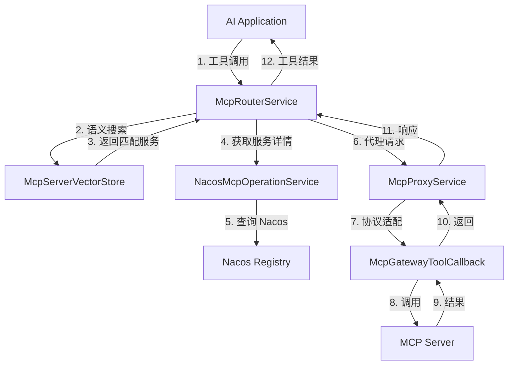

# Spring AI Alibaba MCP 模块专项分析

> **版本**: 1.0  
> **作者**: Spring AI Alibaba Team  
> **最后更新**: 2025-10-02

---

## 📑 目录

1. [模块概述](#1-模块概述)
2. [MCP 协议详解](#2-mcp-协议详解)
3. [架构设计](#3-架构设计)
4. [核心子模块](#4-核心子模块)
5. [MCP Registry 注册发现](#5-mcp-registry-注册发现)
6. [MCP Router 智能路由](#6-mcp-router-智能路由)
7. [MCP Gateway 网关实现](#7-mcp-gateway-网关实现)
8. [协议通信](#8-协议通信)
9. [工具管理](#9-工具管理)
10. [服务发现](#10-服务发现)
11. [可观测性](#11-可观测性)
12. [最佳实践](#12-最佳实践)
13. [配置指南](#13-配置指南)

---

## 1. 模块概述

### 1.1 什么是 MCP

**MCP (Model Context Protocol)** 是一个开放协议，用于在 AI 应用和外部数据源/工具之间建立标准化连接。

**Spring AI Alibaba MCP** 提供完整的 MCP 协议实现，包括：
- 🔌 **服务端实现**: 快速构建 MCP Server
- 🔍 **服务注册发现**: 基于 Nacos 的分布式注册中心
- 🚦 **智能路由**: 语义搜索匹配最合适的 MCP 服务
- 🌉 **网关代理**: 统一管理和代理 MCP 工具调用
- 🔄 **协议适配**: 支持 SSE、Streamable、HTTP 等多种传输协议

### 1.2 模块结构

```
spring-ai-alibaba-mcp/
├── spring-ai-alibaba-mcp-common/          # 公共组件
│   ├── NacosMcpProperties                 # Nacos 配置
│   ├── NacosMcpOperationService           # Nacos 操作服务
│   └── McpTraceExchangeFilterFunction     # 追踪过滤器
│
├── spring-ai-alibaba-mcp-registry/        # 注册发现
│   ├── NacosMcpRegister                   # 服务注册
│   ├── LoadbalancedMcpClient              # 负载均衡客户端
│   └── transport/                         # 传输层
│
└── spring-ai-alibaba-mcp-router/          # 智能路由
    ├── McpRouterService                   # 路由核心服务
    ├── McpProxyService                    # 代理服务
    ├── McpServiceDiscovery                # 服务发现
    ├── McpServerVectorStore               # 向量存储（语义搜索）
    └── gateway/                           # 网关实现
        ├── McpGatewayToolManager          # 工具管理
        └── NacosMcpGatewayToolCallback    # 工具回调
```

### 1.3 依赖关系

```xml
<dependencies>
    <!-- MCP SDK -->
    <dependency>
        <groupId>io.modelcontextprotocol.sdk</groupId>
        <artifactId>mcp</artifactId>
        <version>${mcp.version}</version>
    </dependency>
    
    <!-- Nacos 服务发现 -->
    <dependency>
        <groupId>com.alibaba.nacos</groupId>
        <artifactId>nacos-client</artifactId>
    </dependency>
    
    <!-- Spring AI Core -->
    <dependency>
        <groupId>org.springframework.ai</groupId>
        <artifactId>spring-ai-commons</artifactId>
    </dependency>
    
    <!-- WebFlux（用于 SSE 通信）-->
    <dependency>
        <groupId>org.springframework</groupId>
        <artifactId>spring-webflux</artifactId>
    </dependency>
    
    <!-- OkHttp（用于 HTTP 客户端）-->
    <dependency>
        <groupId>com.squareup.okhttp3</groupId>
        <artifactId>okhttp</artifactId>
    </dependency>
</dependencies>
```

---

## 2. MCP 协议详解

### 2.1 MCP 核心概念

**MCP 定义了三个核心概念**：

1. **Resources（资源）**: 外部数据源（如文件、数据库、API）
2. **Prompts（提示模板）**: 预定义的 AI 提示模板
3. **Tools（工具）**: AI 可调用的功能函数

**Spring AI Alibaba MCP 主要聚焦于 Tools 实现。**

### 2.2 MCP 工具规范

**工具定义示例**：

```json
{
  "name": "get_weather",
  "description": "获取指定城市的天气信息",
  "inputSchema": {
    "type": "object",
    "properties": {
      "city": {
        "type": "string",
        "description": "城市名称"
      },
      "unit": {
        "type": "string",
        "enum": ["celsius", "fahrenheit"],
        "default": "celsius"
      }
    },
    "required": ["city"]
  }
}
```

**工具调用流程**：

```
AI Client → MCP Router → MCP Server → External Service
    ↑                                        ↓
    └────────── Result ──────────────────────┘
```

### 2.3 支持的传输协议

| 协议类型 | 说明 | 适用场景 |
|---------|------|---------|
| **stdio** | 标准输入/输出 | 本地进程通信 |
| **SSE** | Server-Sent Events | 单向实时推送 |
| **Streamable** | 双向流式传输 | 双向实时通信 |
| **HTTP** | RESTful API | 简单请求/响应 |
| **HTTPS** | 加密 HTTP | 安全的 RESTful API |

---

## 3. 架构设计

### 3.1 整体架构

```
┌─────────────────────────────────────────────────────────────┐
│                     AI Application Layer                     │
│        (ReactAgent, ChatClient with Tools)                   │
└─────────────────────────────────────────────────────────────┘
                            ↓
┌─────────────────────────────────────────────────────────────┐
│                      MCP Router Layer                        │
│    (语义搜索 → 服务发现 → 智能路由 → 工具代理)              │
└─────────────────────────────────────────────────────────────┘
                            ↓
┌─────────────────────────────────────────────────────────────┐
│                    MCP Gateway Layer                         │
│    (工具定义管理 → 协议转换 → 请求代理)                     │
└─────────────────────────────────────────────────────────────┘
                            ↓
┌─────────────────────────────────────────────────────────────┐
│                   MCP Registry (Nacos)                       │
│    (服务注册 → 服务发现 → 负载均衡 → 健康检查)              │
└─────────────────────────────────────────────────────────────┘
                            ↓
┌─────────────────────────────────────────────────────────────┐
│                     MCP Server Instances                     │
│    (Weather Server, Database Server, File Server, ...)      │
└─────────────────────────────────────────────────────────────┘
```

### 3.2 核心组件关系



---

## 4. 核心子模块

### 4.1 spring-ai-alibaba-mcp-common

**公共组件模块，提供基础服务。**

**核心类**：

1. **NacosMcpProperties**: Nacos 配置管理

```java
@ConfigurationProperties(prefix = "spring.ai.alibaba.mcp.nacos")
public class NacosMcpProperties {
    private String serverAddr;        // Nacos 服务器地址
    private String namespace;         // 命名空间
    private String username;          // 认证用户名
    private String password;          // 认证密码
    private String ip;                // 本机 IP
    private String groupName;         // 分组名称
}
```

2. **NacosMcpOperationService**: Nacos 操作封装

```java
public class NacosMcpOperationService {
    // 获取 MCP 服务详情
    public McpServerDetailInfo getServerDetail(String serviceName);
    
    // 订阅服务变更
    public void subscribeNacosMcpServer(String key, Consumer<McpServerDetailInfo> listener);
    
    // 注册服务实例
    public void registerService(String serviceName, String groupName, Instance instance);
    
    // 创建 MCP 服务元数据
    public void createMcpServer(String name, McpServerBasicInfo basicInfo, 
                                List<McpToolSpec> tools, McpEndpointSpec endpoint);
}
```

3. **McpTraceExchangeFilterFunction**: 请求追踪

```java
public class McpTraceExchangeFilterFunction implements ExchangeFilterFunction {
    @Override
    public Mono<ClientResponse> filter(ClientRequest request, ExchangeFunction next) {
        // 注入 Trace ID
        // 记录请求时长
        // 记录错误信息
    }
}
```

### 4.2 spring-ai-alibaba-mcp-registry

**服务注册与发现模块。**

**核心功能**：
- ✅ 自动服务注册
- ✅ 服务健康检查
- ✅ 负载均衡
- ✅ 服务订阅更新

**关键实现** 将在后续章节详细介绍。

### 4.3 spring-ai-alibaba-mcp-router

**智能路由与网关模块。**

**核心功能**：
- ✅ 语义搜索（基于向量相似度）
- ✅ 服务发现与管理
- ✅ 工具请求代理
- ✅ 协议转换

**关键实现** 将在后续章节详细介绍。

---

## 5. MCP Registry 注册发现

### 5.1 服务注册流程

**NacosMcpRegister 完整流程**：

```java
public class NacosMcpRegister implements ApplicationListener<WebServerInitializedEvent> {
    
    public NacosMcpRegister(...) {
        // 1. 验证配置
        if (StringUtils.isBlank(mcpServerProperties.getVersion())) {
            throw new IllegalArgumentException("MCP Server version is required");
        }
        
        // 2. 获取 MCP Server 信息
        this.serverInfo = mcpAsyncServer.getServerInfo();
        this.serverCapabilities = mcpAsyncServer.getServerCapabilities();
        
        // 3. 反射获取工具列表
        Field toolsField = McpAsyncServer.class.getDeclaredField("tools");
        toolsField.setAccessible(true);
        this.tools = (CopyOnWriteArrayList<...>) toolsField.get(mcpAsyncServer);
        
        // 4. 检查是否已存在
        McpServerDetailInfo existing = nacosMcpOperationService.getServerDetail(
            serverInfo.name(), 
            serverInfo.version()
        );
        
        // 5. 注册或更新
        if (existing == null) {
            nacosMcpOperationService.createMcpServer(
                serverInfo.name(), 
                serverBasicInfo, 
                mcpToolSpec, 
                endpointSpec
            );
        } else {
            // 兼容性检查
            CheckCompatibleResult result = checkCompatible(existing);
            if (!result.isCompatible()) {
                throw new Exception("Incompatible MCP Server: " + result.getMessage());
            }
        }
        
        // 6. 订阅服务更新
        subscribe();
    }
    
    @Override
    public void onApplicationEvent(WebServerInitializedEvent event) {
        // 7. Web 服务器启动后注册服务实例
        int port = event.getWebServer().getPort();
        Instance instance = new Instance();
        instance.setIp(nacosMcpProperties.getIp());
        instance.setPort(port);
        
        nacosMcpOperationService.registerService(
            serviceName, 
            groupName, 
            instance
        );
    }
}
```

### 5.2 服务元数据结构

**McpServerDetailInfo（Nacos 存储的完整信息）**：

```java
public class McpServerDetailInfo {
    // 基础信息
    private String name;                    // 服务名称
    private String description;             // 服务描述
    private String protocol;                // 协议类型
    
    // 版本信息
    private McpVersionDetail versionDetail;
    
    // 远程服务配置
    private McpServerRemoteServiceConfig remoteServerConfig;
    
    // 工具列表
    private List<McpToolMeta> tools;
    
    // 端点配置
    private McpEndpointSpec endpointSpec;
}

// 版本详情
public class McpVersionDetail {
    private String version;                 // 版本号
    private String protocolVersion;         // MCP 协议版本
}

// 远程服务配置
public class McpServerRemoteServiceConfig {
    private McpServiceRef serviceRef;       // 服务引用
    private String endpoint;                // 服务端点
    private Map<String, String> headers;    // 自定义请求头
}

// 服务引用
public class McpServiceRef {
    private String serviceName;             // Nacos 服务名
    private String groupName;               // Nacos 分组
    private String namespaceId;             // Nacos 命名空间
}

// 工具元数据
public class McpToolMeta {
    private String name;                    // 工具名称
    private String description;             // 工具描述
    private Map<String, Object> inputSchema;// 输入参数 Schema
    private boolean enabled;                // 是否启用
}
```

### 5.3 负载均衡客户端

**LoadbalancedMcpAsyncClient**：

```java
public class LoadbalancedMcpAsyncClient implements McpAsyncClient {
    
    private final NamingService namingService;
    private final String serviceName;
    private final String groupName;
    private final LoadBalancer loadBalancer;
    
    @Override
    public CompletableFuture<CallToolResult> callTool(CallToolRequest request) {
        // 1. 获取可用实例列表
        List<Instance> instances = namingService.selectInstances(
            serviceName, 
            groupName, 
            true  // 只返回健康实例
        );
        
        if (instances.isEmpty()) {
            throw new NoAvailableInstanceException(serviceName);
        }
        
        // 2. 负载均衡选择实例
        Instance instance = loadBalancer.choose(instances);
        
        // 3. 构建客户端并调用
        String url = buildUrl(instance);
        McpAsyncClient client = McpAsyncClientBuilder.create(url).build();
        
        return client.callTool(request)
            .exceptionally(error -> {
                // 4. 失败重试（选择其他实例）
                return retryWithAnotherInstance(request, instances, instance);
            });
    }
}
```

**负载均衡策略**：
- **轮询（Round Robin）**: 默认策略
- **随机（Random）**: 随机选择实例
- **权重（Weighted）**: 根据实例权重分配
- **最少连接（Least Connections）**: 选择连接数最少的实例

### 5.4 服务订阅与更新

**动态更新机制**：

```java
private void subscribe() {
    nacosMcpOperationService.subscribeNacosMcpServer(
        serverInfo.name() + "::" + serverInfo.version(),
        (updatedInfo) -> {
            log.info("Received MCP Server update: {}", updatedInfo.getName());
            
            // 更新本地工具定义
            if (serverCapabilities.tools() != null) {
                updateTools(updatedInfo);
            }
        }
    );
}

private void updateTools(McpServerDetailInfo serverDetailInfo) {
    List<McpToolMeta> remoteMetas = serverDetailInfo.getTools();
    boolean changed = false;
    
    for (McpToolMeta remoteMeta : remoteMetas) {
        AsyncToolSpecification local = findLocalTool(remoteMeta.getName());
        
        if (local != null) {
            // 更新描述
            if (!Objects.equals(local.description(), remoteMeta.getDescription())) {
                updateToolDescription(local, remoteMeta.getDescription());
                changed = true;
            }
            
            // 更新 Schema
            if (!compareToolsMeta(local, remoteMeta)) {
                updateToolSchema(local, remoteMeta.getInputSchema());
                changed = true;
            }
        }
    }
    
    // 通知客户端工具列表变更
    if (changed && serverCapabilities.tools().listChanged()) {
        mcpAsyncServer.notifyToolsListChanged().block();
    }
}
```

---

## 6. MCP Router 智能路由

### 6.1 McpRouterService 核心服务

**McpRouterService** 是 MCP Router 的核心，提供：
- 📊 **语义搜索**: 根据任务描述匹配合适的 MCP Server
- 🔧 **服务管理**: 添加、初始化和管理 MCP Server
- 🚀 **工具代理**: 代理 LLM 和 MCP Server 之间的工具调用
- 🩺 **连接诊断**: 提供详细的连接状态和问题排查信息

```java
public class McpRouterService {
    
    private final McpServiceDiscovery mcpServiceDiscovery;
    private final McpServerVectorStore mcpServerVectorStore;
    private final NacosMcpOperationService nacosMcpOperationService;
    private final McpProxyService mcpProxyService;
    
    /**
     * 搜索 MCP Server
     * 根据任务描述和关键词进行语义搜索
     */
    @Tool(description = "根据任务描述搜索合适的 MCP Server")
    public McpServerSearchResponse searchMcpServers(
        @ToolParam(description = "任务描述") String taskDescription,
        @ToolParam(description = "关键词") String keywords,
        @ToolParam(description = "返回数量") Integer limit
    ) {
        // 1. 向量搜索
        List<Document> docs = mcpServerVectorStore.similaritySearch(
            SearchRequest.query(taskDescription).withTopK(limit != null ? limit : 5)
        );
        
        // 2. 关键词过滤
        if (keywords != null && !keywords.isEmpty()) {
            docs = filterByKeywords(docs, keywords.split(","));
        }
        
        // 3. 构建响应
        List<McpServerInfo> servers = docs.stream()
            .map(doc -> buildServerInfo(doc))
            .toList();
        
        return McpServerSearchResponse.builder()
            .servers(servers)
            .totalCount(servers.size())
            .build();
    }
    
    /**
     * 添加 MCP Server
     */
    @Tool(description = "添加并初始化 MCP Server")
    public McpServerAddResponse addMcpServer(
        @ToolParam(description = "服务名称") String serviceName
    ) {
        try {
            // 1. 获取服务详情
            McpServerDetailInfo detail = nacosMcpOperationService.getServerDetail(serviceName);
            
            if (detail == null) {
                return McpServerAddResponse.failure("Service not found: " + serviceName);
            }
            
            // 2. 建立连接
            boolean connected = initializeMcpServer(detail);
            
            // 3. 索引到向量库
            if (connected) {
                indexServerToVectorStore(detail);
            }
            
            return McpServerAddResponse.success(serviceName);
        } catch (Exception e) {
            return McpServerAddResponse.failure("Failed to add server: " + e.getMessage());
        }
    }
    
    /**
     * 执行工具调用
     */
    @Tool(description = "执行 MCP 工具调用")
    public McpToolExecutionResponse executeTool(
        @ToolParam(description = "服务名称") String serviceName,
        @ToolParam(description = "工具名称") String toolName,
        @ToolParam(description = "工具参数") Map<String, Object> args
    ) {
        try {
            // 代理到 McpProxyService
            String result = mcpProxyService.callTool(serviceName, toolName, args);
            
            return McpToolExecutionResponse.success(result);
        } catch (Exception e) {
            return McpToolExecutionResponse.failure(e.getMessage());
        }
    }
}
```

### 6.2 语义搜索实现

**McpServerVectorStore 架构**：

```java
public class McpServerVectorStore implements VectorStore {
    
    private final VectorStore delegate;  // 底层向量库（如 Qdrant, Milvus）
    private final EmbeddingModel embeddingModel;
    
    /**
     * 索引 MCP Server
     */
    public void indexMcpServer(McpServerDetailInfo serverInfo) {
        // 1. 构建文档内容（用于向量化）
        String content = buildServerDescription(serverInfo);
        
        // 2. 创建 Document
        Document doc = Document.builder()
            .id(serverInfo.getName())
            .content(content)
            .metadata(Map.of(
                "name", serverInfo.getName(),
                "description", serverInfo.getDescription(),
                "protocol", serverInfo.getProtocol(),
                "tools", serverInfo.getTools().stream()
                    .map(McpToolMeta::getName)
                    .collect(Collectors.joining(", "))
            ))
            .build();
        
        // 3. 向量化并存储
        delegate.add(List.of(doc));
    }
    
    /**
     * 构建服务描述（用于向量化）
     */
    private String buildServerDescription(McpServerDetailInfo serverInfo) {
        StringBuilder sb = new StringBuilder();
        
        // 服务名称和描述
        sb.append("Service: ").append(serverInfo.getName()).append("\n");
        sb.append("Description: ").append(serverInfo.getDescription()).append("\n\n");
        
        // 工具列表和描述
        sb.append("Available Tools:\n");
        for (McpToolMeta tool : serverInfo.getTools()) {
            sb.append("- ").append(tool.getName())
              .append(": ").append(tool.getDescription())
              .append("\n");
        }
        
        return sb.toString();
    }
    
    @Override
    public List<Document> similaritySearch(SearchRequest request) {
        // 委托给底层向量库
        return delegate.similaritySearch(request);
    }
}
```

**向量库集成**：

```java
// 配置向量库
@Configuration
public class VectorStoreConfig {
    
    @Bean
    public VectorStore vectorStore(EmbeddingModel embeddingModel) {
        // 使用 Qdrant
        QdrantVectorStoreConfig config = QdrantVectorStoreConfig.builder()
            .host("localhost")
            .port(6333)
            .collectionName("mcp_servers")
            .build();
        
        return new QdrantVectorStore(config, embeddingModel);
        
        // 或使用其他向量库
        // return new MilvusVectorStore(...);
        // return new WeaviateVectorStore(...);
    }
}
```

### 6.3 服务发现

**CompositeMcpServiceDiscovery（组合发现）**：

```java
public class CompositeMcpServiceDiscovery implements McpServiceDiscovery {
    
    private final List<McpServiceDiscovery> discoveries;
    private final List<String> discoveryOrder;
    
    @Override
    public List<McpServerInfo> discoverServices() {
        List<McpServerInfo> allServers = new ArrayList<>();
        
        // 按配置的顺序查找服务
        for (String discoveryType : discoveryOrder) {
            McpServiceDiscovery discovery = findDiscovery(discoveryType);
            
            if (discovery != null) {
                List<McpServerInfo> servers = discovery.discoverServices();
                allServers.addAll(servers);
            }
        }
        
        // 去重
        return deduplicateServers(allServers);
    }
}
```

**支持的发现方式**：

| 发现类型 | 实现类 | 说明 |
|---------|--------|------|
| **nacos** | `NacosMcpServiceDiscovery` | 从 Nacos 发现服务 |
| **file** | `FileMcpServiceDiscovery` | 从配置文件读取 |
| **database** | `DatabaseMcpServiceDiscovery` | 从数据库查询 |
| **http** | `HttpMcpServiceDiscovery` | 从 HTTP API 获取 |

**配置示例**：

```yaml
spring:
  ai:
    alibaba:
      mcp:
        router:
          discovery-order:
            - nacos        # 优先从 Nacos 查找
            - file         # 其次从文件读取
            - database     # 最后从数据库查询
```

### 6.4 McpRouterWatcher（定时监控）

```java
public class McpRouterWatcher {
    
    private final McpServiceDiscovery serviceDiscovery;
    private final McpServerVectorStore vectorStore;
    private final ScheduledExecutorService scheduler;
    
    @PostConstruct
    public void startWatching() {
        // 定时扫描服务变更
        scheduler.scheduleAtFixedRate(
            this::updateServices,
            0,
            60,  // 每 60 秒
            TimeUnit.SECONDS
        );
    }
    
    private void updateServices() {
        try {
            // 1. 发现所有服务
            List<McpServerInfo> services = serviceDiscovery.discoverServices();
            
            // 2. 比较变更
            Set<String> currentServices = getCurrentIndexedServices();
            Set<String> newServices = services.stream()
                .map(McpServerInfo::getName)
                .collect(Collectors.toSet());
            
            // 3. 新增的服务 → 索引
            Set<String> added = Sets.difference(newServices, currentServices);
            for (String serviceName : added) {
                McpServerInfo info = findService(services, serviceName);
                vectorStore.indexMcpServer(convertToDetailInfo(info));
                log.info("Indexed new MCP Server: {}", serviceName);
            }
            
            // 4. 移除的服务 → 删除索引
            Set<String> removed = Sets.difference(currentServices, newServices);
            for (String serviceName : removed) {
                vectorStore.delete(List.of(serviceName));
                log.info("Removed MCP Server from index: {}", serviceName);
            }
            
        } catch (Exception e) {
            log.error("Failed to update MCP Server index", e);
        }
    }
}
```

---

## 7. MCP Gateway 网关实现

### 7.1 网关架构

**MCP Gateway 作为统一入口**：

```
┌─────────────────────────────────────────────┐
│            MCP Gateway                       │
│                                              │
│  ┌────────────────────────────────────┐    │
│  │   McpGatewayToolManager            │    │
│  │   (工具注册/管理/删除)             │    │
│  └────────────────────────────────────┘    │
│                  ↓                           │
│  ┌────────────────────────────────────┐    │
│  │   McpGatewayToolDefinition         │    │
│  │   (工具定义抽象)                   │    │
│  └────────────────────────────────────┘    │
│                  ↓                           │
│  ┌────────────────────────────────────┐    │
│  │   McpGatewayToolCallback           │    │
│  │   (工具调用回调)                   │    │
│  └────────────────────────────────────┘    │
│                  ↓                           │
│  ┌────────────────────────────────────┐    │
│  │   Protocol Adapter                 │    │
│  │   (HTTP/SSE/Streamable 协议适配)  │    │
│  └────────────────────────────────────┘    │
└─────────────────────────────────────────────┘
                  ↓
         ┌────────┴────────┐
         ↓                  ↓
    MCP Server A      MCP Server B
```

### 7.2 工具定义管理

**McpGatewayToolDefinition 抽象**：

```java
public abstract class McpGatewayToolDefinition implements ToolDefinition {
    
    protected String name;                  // 工具名称
    protected String description;           // 工具描述
    protected String version;               // 工具版本
    protected String protocol;              // 协议类型
    protected Boolean enabled;              // 是否启用
    protected Object inputSchema;           // 输入参数 Schema
    
    // 实现 ToolDefinition 接口
    @Override
    public String getName() {
        return name;
    }
    
    @Override
    public String getDescription() {
        return description;
    }
    
    @Override
    public Object getInputSchema() {
        return inputSchema;
    }
}
```

**NacosMcpGatewayToolDefinition（Nacos 实现）**：

```java
public class NacosMcpGatewayToolDefinition extends McpGatewayToolDefinition {
    
    private String serviceName;             // Nacos 服务名
    private String serverName;              // MCP Server 名称
    private McpServerRemoteServiceConfig remoteConfig;
    
    // 从 Nacos 服务详情构建
    public static NacosMcpGatewayToolDefinition fromServerDetail(
        McpServerDetailInfo serverDetail,
        McpToolMeta toolMeta
    ) {
        NacosMcpGatewayToolDefinition definition = new NacosMcpGatewayToolDefinition();
        
        definition.setName(toolMeta.getName());
        definition.setDescription(toolMeta.getDescription());
        definition.setInputSchema(toolMeta.getInputSchema());
        definition.setEnabled(toolMeta.isEnabled());
        definition.setProtocol(serverDetail.getProtocol());
        definition.setVersion(serverDetail.getVersionDetail().getVersion());
        definition.setServerName(serverDetail.getName());
        definition.setRemoteConfig(serverDetail.getRemoteServerConfig());
        
        return definition;
    }
}
```

### 7.3 工具回调实现

**NacosMcpGatewayToolCallback**：

```java
public class NacosMcpGatewayToolCallback implements ToolCallback, Closeable {
    
    private final NacosMcpGatewayToolDefinition toolDefinition;
    private McpSyncClient mcpClient;  // 可能为空（按需创建）
    
    @Override
    public String getName() {
        return toolDefinition.getName();
    }
    
    @Override
    public String getDescription() {
        return toolDefinition.getDescription();
    }
    
    @Override
    public String call(String toolInput) {
        try {
            // 1. 解析工具参数
            Map<String, Object> args = parseToolInput(toolInput);
            
            // 2. 根据协议调用
            String protocol = toolDefinition.getProtocol();
            
            switch (protocol.toLowerCase()) {
                case "http":
                case "https":
                    return callHttpProtocol(args);
                
                case "mcp-sse":
                case "mcp-streamable":
                    return callMcpStreamProtocol(args);
                
                default:
                    throw new UnsupportedOperationException("Unsupported protocol: " + protocol);
            }
            
        } catch (Exception e) {
            log.error("Tool execution failed: {}", getName(), e);
            return "Error: " + e.getMessage();
        }
    }
    
    /**
     * 处理 HTTP/HTTPS 协议
     */
    private String callHttpProtocol(Map<String, Object> args) {
        McpServerRemoteServiceConfig config = toolDefinition.getRemoteConfig();
        
        // 使用模板解析请求
        RequestTemplateInfo requestInfo = RequestTemplateParser.parse(
            config.getRequestTemplate(),
            args
        );
        
        // 发送 HTTP 请求
        WebClient webClient = WebClient.create(config.getEndpoint());
        String response = webClient
            .method(requestInfo.getMethod())
            .uri(requestInfo.getUri())
            .headers(headers -> headers.putAll(requestInfo.getHeaders()))
            .bodyValue(requestInfo.getBody())
            .retrieve()
            .bodyToMono(String.class)
            .block();
        
        // 解析响应
        return ResponseTemplateParser.parse(
            config.getResponseTemplate(),
            response
        );
    }
    
    /**
     * 处理 MCP-SSE/Streamable 协议
     */
    private String callMcpStreamProtocol(Map<String, Object> args) throws Exception {
        // 1. 获取或创建 MCP 客户端
        if (mcpClient == null) {
            mcpClient = buildMcpClient();
        }
        
        // 2. 构建 MCP 调用请求
        CallToolRequest request = CallToolRequest.builder()
            .name(toolDefinition.getName())
            .arguments(args)
            .build();
        
        // 3. 调用并等待结果
        CallToolResult result = mcpClient.callTool(request).get();
        
        // 4. 提取结果
        return extractToolResult(result);
    }
    
    private McpSyncClient buildMcpClient() {
        McpServerRemoteServiceConfig config = toolDefinition.getRemoteConfig();
        String protocol = toolDefinition.getProtocol();
        
        if ("mcp-sse".equalsIgnoreCase(protocol)) {
            // SSE 传输
            return McpSyncClientBuilder.create(config.getEndpoint())
                .transport(new SseClientTransport(config.getEndpoint()))
                .build();
        } else {
            // Streamable 传输
            return McpSyncClientBuilder.create(config.getEndpoint())
                .transport(new StreamableClientTransport(config.getEndpoint()))
                .build();
        }
    }
    
    @Override
    public void close() {
        if (mcpClient != null) {
            mcpClient.close();
        }
    }
}
```

### 7.4 工具初始化器

**NacosMcpGatewayToolsInitializer**：

```java
public class NacosMcpGatewayToolsInitializer implements McpGatewayToolsInitializer {
    
    private final NacosMcpGatewayProperties properties;
    private final NacosMcpOperationService operationService;
    
    @Override
    public List<ToolCallback> initializeTools() {
        List<String> serviceNames = properties.getServiceNames();
        
        if (serviceNames == null || serviceNames.isEmpty()) {
            log.warn("No service names configured");
            return new ArrayList<>();
        }
        
        List<ToolCallback> allTools = new ArrayList<>();
        
        for (String serviceName : serviceNames) {
            try {
                // 1. 获取服务详情
                McpServerDetailInfo serverDetail = operationService.getServerDetail(serviceName);
                
                if (serverDetail == null) {
                    log.warn("Service not found: {}", serviceName);
                    continue;
                }
                
                // 2. 解析工具列表
                List<ToolCallback> tools = parseToolsFromServerDetail(serverDetail);
                
                if (tools.isEmpty()) {
                    log.warn("No tools found for service: {}", serviceName);
                    continue;
                }
                
                allTools.addAll(tools);
                log.info("Initialized {} tools from service: {}", tools.size(), serviceName);
                
            } catch (Exception e) {
                log.error("Failed to initialize tools for service: {}", serviceName, e);
            }
        }
        
        return allTools;
    }
    
    private List<ToolCallback> parseToolsFromServerDetail(McpServerDetailInfo serverDetail) {
        List<ToolCallback> tools = new ArrayList<>();
        
        for (McpToolMeta toolMeta : serverDetail.getTools()) {
            // 跳过禁用的工具
            if (!toolMeta.isEnabled()) {
                continue;
            }
            
            // 创建工具定义
            NacosMcpGatewayToolDefinition definition = 
                NacosMcpGatewayToolDefinition.fromServerDetail(serverDetail, toolMeta);
            
            // 创建工具回调
            NacosMcpGatewayToolCallback callback = 
                new NacosMcpGatewayToolCallback(definition);
            
            tools.add(callback);
        }
        
        return tools;
    }
}
```

---

## 8. 协议通信

### 8.1 SSE（Server-Sent Events）通信

**WebFluxSseClientTransport**：

```java
public class WebFluxSseClientTransport implements McpTransport {
    
    private final String endpoint;
    private final WebClient webClient;
    
    @Override
    public CompletableFuture<JSONRPCResponse> sendRequest(JSONRPCRequest request) {
        CompletableFuture<JSONRPCResponse> future = new CompletableFuture<>();
        
        // 发送 SSE 请求
        webClient
            .post()
            .uri(endpoint)
            .contentType(MediaType.APPLICATION_JSON)
            .bodyValue(request)
            .accept(MediaType.TEXT_EVENT_STREAM)
            .retrieve()
            .bodyToFlux(ServerSentEvent.class)
            .subscribe(
                event -> {
                    // 处理 SSE 事件
                    String data = event.data();
                    if (data != null) {
                        JSONRPCResponse response = parseResponse(data);
                        if (response.getId().equals(request.getId())) {
                            future.complete(response);
                        }
                    }
                },
                error -> future.completeExceptionally(error),
                () -> {
                    if (!future.isDone()) {
                        future.completeExceptionally(new Exception("SSE stream closed"));
                    }
                }
            );
        
        return future;
    }
}
```

### 8.2 Streamable 双向流通信

**StreamableClientTransport**：

```java
public class StreamableClientTransport implements McpTransport {
    
    private final String endpoint;
    private WebSocketSession session;
    private final Map<String, CompletableFuture<JSONRPCResponse>> pendingRequests;
    
    public StreamableClientTransport(String endpoint) {
        this.endpoint = endpoint;
        this.pendingRequests = new ConcurrentHashMap<>();
        
        // 建立 WebSocket 连接
        connectWebSocket();
    }
    
    private void connectWebSocket() {
        WebSocketClient client = new StandardWebSocketClient();
        
        client.execute(new WebSocketHandler() {
            @Override
            public void handleMessage(WebSocketSession session, WebSocketMessage<?> message) {
                String payload = message.getPayload().toString();
                JSONRPCResponse response = parseResponse(payload);
                
                // 完成对应的 Future
                CompletableFuture<JSONRPCResponse> future = pendingRequests.remove(response.getId());
                if (future != null) {
                    future.complete(response);
                }
            }
        }, endpoint);
    }
    
    @Override
    public CompletableFuture<JSONRPCResponse> sendRequest(JSONRPCRequest request) {
        CompletableFuture<JSONRPCResponse> future = new CompletableFuture<>();
        
        // 注册待处理请求
        pendingRequests.put(request.getId(), future);
        
        // 发送请求
        try {
            String payload = objectMapper.writeValueAsString(request);
            session.sendMessage(new TextMessage(payload));
        } catch (Exception e) {
            pendingRequests.remove(request.getId());
            future.completeExceptionally(e);
        }
        
        return future;
    }
}
```

### 8.3 HTTP 简单调用

```java
public String callHttpTool(String endpoint, Map<String, Object> args) {
    WebClient webClient = WebClient.create(endpoint);
    
    return webClient
        .post()
        .contentType(MediaType.APPLICATION_JSON)
        .bodyValue(args)
        .retrieve()
        .bodyToMono(String.class)
        .block();
}
```

---

## 9. 工具管理

### 9.1 工具生命周期

```
初始化 → 注册 → 激活 → 使用 → 更新 → 禁用 → 删除
   ↓       ↓      ↓      ↓      ↓      ↓      ↓
  Init   Add    Enable  Call  Update Disable Remove
```

### 9.2 McpGatewayToolManager 接口

```java
public interface McpGatewayToolManager {
    
    /**
     * 添加工具
     */
    void addTool(McpGatewayToolDefinition toolDefinition);
    
    /**
     * 删除工具
     */
    void removeTool(String toolName);
    
    /**
     * 更新工具
     */
    default void updateTool(McpGatewayToolDefinition toolDefinition) {
        removeTool(toolDefinition.getName());
        addTool(toolDefinition);
    }
    
    /**
     * 获取所有工具
     */
    default List<McpGatewayToolDefinition> getAllTools() {
        throw new UnsupportedOperationException();
    }
}
```

### 9.3 动态工具管理

**NacosMcpAsyncGatewayToolsProvider**：

```java
public class NacosMcpAsyncGatewayToolsProvider implements McpGatewayToolManager {
    
    private final McpAsyncServer mcpAsyncServer;
    private final Map<String, NacosMcpGatewayToolCallback> toolCallbacks = new HashMap<>();
    
    @Override
    public void addTool(McpGatewayToolDefinition toolDefinition) {
        // 1. 先删除旧工具（如果存在）
        try {
            removeTool(toolDefinition.getName());
        } catch (Exception e) {
            // 忽略
        }
        
        // 2. 创建新工具回调
        NacosMcpGatewayToolCallback callback = new NacosMcpGatewayToolCallback(toolDefinition);
        toolCallbacks.put(toolDefinition.getName(), callback);
        
        // 3. 注册到 MCP Server
        mcpAsyncServer.addTool(McpToolUtils.toAsyncToolSpecification(callback));
        
        log.info("Tool added: {}", toolDefinition.getName());
    }
    
    @Override
    public void removeTool(String toolName) {
        // 1. 获取回调
        NacosMcpGatewayToolCallback callback = toolCallbacks.remove(toolName);
        
        if (callback != null) {
            // 2. 关闭资源
            callback.close();
            
            // 3. 从 MCP Server 移除
            mcpAsyncServer.removeTool(toolName);
            
            log.info("Tool removed: {}", toolName);
        }
    }
}
```

---

## 10. 服务发现

### 10.1 发现策略

**NacosMcpServiceDiscovery**：

```java
public class NacosMcpServiceDiscovery implements McpServiceDiscovery {
    
    private final NacosMcpOperationService operationService;
    
    @Override
    public List<McpServerInfo> discoverServices() {
        try {
            // 1. 从 Nacos 查询所有 MCP 服务
            List<String> serviceNames = operationService.getAllMcpServerNames();
            
            // 2. 获取每个服务的详情
            List<McpServerInfo> servers = new ArrayList<>();
            for (String serviceName : serviceNames) {
                McpServerDetailInfo detail = operationService.getServerDetail(serviceName);
                if (detail != null) {
                    servers.add(convertToServerInfo(detail));
                }
            }
            
            return servers;
            
        } catch (Exception e) {
            log.error("Failed to discover MCP services from Nacos", e);
            return Collections.emptyList();
        }
    }
    
    private McpServerInfo convertToServerInfo(McpServerDetailInfo detail) {
        return McpServerInfo.builder()
            .name(detail.getName())
            .description(detail.getDescription())
            .protocol(detail.getProtocol())
            .version(detail.getVersionDetail().getVersion())
            .tools(detail.getTools().stream()
                .map(McpToolMeta::getName)
                .toList())
            .build();
    }
}
```

### 10.2 服务健康检查

```java
@Scheduled(fixedDelay = 30000)  // 每 30 秒
public void checkServicesHealth() {
    List<McpServerInfo> services = serviceDiscovery.discoverServices();
    
    for (McpServerInfo service : services) {
        try {
            // 发送健康检查请求
            boolean healthy = performHealthCheck(service);
            
            if (!healthy) {
                log.warn("MCP Server unhealthy: {}", service.getName());
                
                // 标记为不健康
                markAsUnhealthy(service.getName());
                
                // 可选：移除工具
                removeToolsForService(service.getName());
            }
            
        } catch (Exception e) {
            log.error("Health check failed for service: {}", service.getName(), e);
        }
    }
}

private boolean performHealthCheck(McpServerInfo service) {
    try {
        // Ping 服务
        WebClient webClient = WebClient.create(service.getEndpoint());
        String response = webClient
            .get()
            .uri("/health")
            .retrieve()
            .bodyToMono(String.class)
            .timeout(Duration.ofSeconds(5))
            .block();
        
        return "OK".equals(response);
    } catch (Exception e) {
        return false;
    }
}
```

---

## 11. 可观测性

### 11.1 追踪集成

**McpTraceExchangeFilterFunction**：

```java
public class McpTraceExchangeFilterFunction implements ExchangeFilterFunction {
    
    private final Tracer tracer;
    
    @Override
    public Mono<ClientResponse> filter(ClientRequest request, ExchangeFunction next) {
        // 1. 创建 Span
        Span span = tracer.spanBuilder("mcp.request")
            .setSpanKind(SpanKind.CLIENT)
            .setAttribute("mcp.service", extractServiceName(request))
            .setAttribute("mcp.tool", extractToolName(request))
            .setAttribute("http.method", request.method().name())
            .setAttribute("http.url", request.url().toString())
            .startSpan();
        
        try (Scope scope = span.makeCurrent()) {
            // 2. 注入 Trace Context
            ClientRequest.Builder builder = ClientRequest.from(request);
            W3CTraceContextPropagator.getInstance().inject(
                Context.current(),
                builder,
                (carrier, key, value) -> carrier.header(key, value)
            );
            
            // 3. 执行请求
            return next.exchange(builder.build())
                .doOnSuccess(response -> {
                    span.setAttribute("http.status_code", response.statusCode().value());
                    span.setStatus(StatusCode.OK);
                })
                .doOnError(error -> {
                    span.recordException(error);
                    span.setStatus(StatusCode.ERROR, error.getMessage());
                })
                .doFinally(signalType -> span.end());
        }
    }
}
```

### 11.2 指标收集

```java
@Component
public class McpMetricsCollector {
    
    private final MeterRegistry meterRegistry;
    
    // 工具调用计数
    private final Counter toolCallCounter;
    
    // 工具调用时长
    private final Timer toolCallTimer;
    
    // 工具调用失败计数
    private final Counter toolCallErrorCounter;
    
    public McpMetricsCollector(MeterRegistry meterRegistry) {
        this.meterRegistry = meterRegistry;
        
        this.toolCallCounter = Counter.builder("mcp.tool.calls")
            .description("Total number of MCP tool calls")
            .tag("type", "total")
            .register(meterRegistry);
        
        this.toolCallTimer = Timer.builder("mcp.tool.duration")
            .description("Duration of MCP tool calls")
            .register(meterRegistry);
        
        this.toolCallErrorCounter = Counter.builder("mcp.tool.errors")
            .description("Number of MCP tool call errors")
            .register(meterRegistry);
    }
    
    public void recordToolCall(String serviceName, String toolName, Duration duration, boolean success) {
        // 记录调用
        toolCallCounter.increment();
        
        // 记录时长
        toolCallTimer.record(duration);
        
        // 记录错误
        if (!success) {
            toolCallErrorCounter.increment();
        }
        
        // 按服务和工具维度记录
        Counter.builder("mcp.tool.calls")
            .tag("service", serviceName)
            .tag("tool", toolName)
            .tag("status", success ? "success" : "failure")
            .register(meterRegistry)
            .increment();
    }
}
```

---

## 12. 最佳实践

### 12.1 服务命名规范

```
推荐格式: {domain}-{service}-mcp-server

示例:
- weather-forecast-mcp-server
- database-query-mcp-server
- file-system-mcp-server
```

### 12.2 工具设计原则

**1. 单一职责**：
```java
// ❌ 不好：一个工具做太多事
@Tool(description = "Process data")
public String processData(String type, Map<String, Object> data);

// ✅ 好：每个工具职责单一
@Tool(description = "Validate data")
public ValidationResult validateData(Map<String, Object> data);

@Tool(description = "Transform data")
public Map<String, Object> transformData(Map<String, Object> data);

@Tool(description = "Save data")
public String saveData(Map<String, Object> data);
```

**2. 清晰的参数定义**：
```json
{
  "inputSchema": {
    "type": "object",
    "properties": {
      "city": {
        "type": "string",
        "description": "城市名称（中文或拼音）",
        "examples": ["北京", "beijing"]
      },
      "days": {
        "type": "integer",
        "description": "预报天数（1-7）",
        "minimum": 1,
        "maximum": 7,
        "default": 3
      }
    },
    "required": ["city"]
  }
}
```

**3. 错误处理**：
```java
@Tool(description = "Query database")
public String queryDatabase(String sql) {
    try {
        List<Map<String, Object>> results = jdbcTemplate.queryForList(sql);
        return objectMapper.writeValueAsString(Map.of(
            "success", true,
            "data", results
        ));
    } catch (DataAccessException e) {
        return objectMapper.writeValueAsString(Map.of(
            "success", false,
            "error", "Database query failed",
            "details", e.getMessage()
        ));
    }
}
```

### 12.3 性能优化

**1. 连接池复用**：
```java
// ✅ 使用连接池
@Bean
public WebClient webClient() {
    return WebClient.builder()
        .clientConnector(new ReactorClientHttpConnector(
            HttpClient.create()
                .responseTimeout(Duration.ofSeconds(30))
                .option(ChannelOption.CONNECT_TIMEOUT_MILLIS, 10000)
        ))
        .build();
}
```

**2. 缓存服务详情**：
```java
@Cacheable(value = "mcpServerDetails", key = "#serviceName")
public McpServerDetailInfo getServerDetail(String serviceName) {
    return nacosMcpOperationService.getServerDetail(serviceName);
}
```

**3. 批量操作**：
```java
// ✅ 批量初始化工具
public void initializeToolsBatch(List<String> serviceNames) {
    List<CompletableFuture<Void>> futures = serviceNames.stream()
        .map(serviceName -> CompletableFuture.runAsync(() -> initializeTools(serviceName)))
        .toList();
    
    CompletableFuture.allOf(futures.toArray(new CompletableFuture[0])).join();
}
```

---

## 13. 配置指南

### 13.1 Nacos MCP 配置

```yaml
spring:
  ai:
    alibaba:
      mcp:
        nacos:
          # Nacos 服务器地址
          server-addr: 127.0.0.1:8848
          
          # 命名空间
          namespace: public
          
          # 分组
          group-name: DEFAULT_GROUP
          
          # 认证信息
          username: nacos
          password: nacos
          
          # 本机 IP（自动检测）
          ip: ${spring.cloud.client.ip-address:localhost}
          
          # 注册配置
          register:
            service-register: true              # 是否注册服务实例
            service-ephemeral: true             # 是否临时实例
            register-as-latest: true            # 是否注册为最新版本
            sse-export-context-path: /mcp       # SSE 端点路径
```

### 13.2 MCP Router 配置

```yaml
spring:
  ai:
    alibaba:
      mcp:
        router:
          # 是否启用 Router
          enabled: true
          
          # 服务发现顺序
          discovery-order:
            - nacos
            - file
          
          # 要管理的服务列表
          service-names:
            - weather-mcp-server
            - database-mcp-server
            - file-mcp-server
```

### 13.3 MCP Gateway 配置

```yaml
spring:
  ai:
    alibaba:
      mcp:
        gateway:
          # 是否启用 Gateway
          enabled: true
          
          # 要代理的服务列表
          service-names:
            - weather-mcp-server
          
          # SSE 配置
          sse:
            connect-timeout: 30s
            read-timeout: 60s
          
          # Streamable 配置
          streamable:
            connect-timeout: 30s
            idle-timeout: 300s
```

### 13.4 向量库配置（语义搜索）

```yaml
spring:
  ai:
    alibaba:
      mcp:
        router:
          vector-store:
            # 向量库类型
            type: qdrant
            
            # Qdrant 配置
            qdrant:
              host: localhost
              port: 6333
              collection-name: mcp_servers
              
            # 或使用 Milvus
            # type: milvus
            # milvus:
            #   host: localhost
            #   port: 19530
            #   database: mcp
            #   collection: servers
```

### 13.5 完整示例配置

```yaml
spring:
  application:
    name: mcp-router-gateway
  
  ai:
    alibaba:
      # DashScope 配置（用于向量化）
      dashscope:
        api-key: ${DASHSCOPE_API_KEY}
      
      mcp:
        # Nacos 配置
        nacos:
          server-addr: ${NACOS_SERVER_ADDR:127.0.0.1:8848}
          namespace: ${NACOS_NAMESPACE:public}
          username: ${NACOS_USERNAME:nacos}
          password: ${NACOS_PASSWORD:nacos}
          
          register:
            service-register: true
            service-ephemeral: true
        
        # Router 配置
        router:
          enabled: true
          discovery-order: [nacos, file]
          service-names:
            - weather-mcp-server
            - calculator-mcp-server
          
          vector-store:
            type: qdrant
            qdrant:
              host: ${QDRANT_HOST:localhost}
              port: ${QDRANT_PORT:6333}
              collection-name: mcp_servers
        
        # Gateway 配置
        gateway:
          enabled: true
          service-names:
            - weather-mcp-server
            - calculator-mcp-server

# 可观测性配置
management:
  tracing:
    enabled: true
    sampling:
      probability: 1.0
  
  metrics:
    export:
      prometheus:
        enabled: true
  
  endpoints:
    web:
      exposure:
        include: health,info,metrics,prometheus
```

---

## 📚 总结

Spring AI Alibaba MCP 模块提供了完整的 MCP 协议实现：

### 核心优势

1. **分布式注册发现**: 基于 Nacos 的服务注册与发现，支持负载均衡和健康检查
2. **智能路由**: 通过语义搜索自动匹配最合适的 MCP 服务
3. **多协议支持**: SSE、Streamable、HTTP/HTTPS 等多种传输协议
4. **网关代理**: 统一管理和代理工具调用，支持动态工具管理
5. **完整的可观测性**: 集成 OpenTelemetry 追踪和 Prometheus 指标
6. **高可用**: 支持服务降级、重试和故障转移

### 适用场景

- ✅ 构建 MCP Server 提供工具服务
- ✅ 集成多个 MCP Server 到 AI 应用
- ✅ 需要分布式部署的 MCP 服务集群
- ✅ 需要智能路由和服务发现的场景
- ✅ 企业级 AI 应用开发

---

**相关文档**：
- [spring-ai-alibaba-graph-core 模块专项分析](./spring-ai-alibaba-graph-core模块专项分析.md)
- [spring-ai-alibaba-a2a 模块专项分析](./spring-ai-alibaba-a2a模块专项分析.md)
- [核心模块深入分析](./核心模块深入分析.md)

